# Mess Module - Visual Flowcharts & Diagrams

This document contains detailed visual flowcharts for the Mess Module operations. These diagrams can be rendered using Mermaid or similar tools.

---

## Table of Contents
1. [Overall System Architecture](#overall-system-architecture)
2. [Master Data Setup Flow](#master-data-setup-flow)
3. [Purchase Order Complete Flow](#purchase-order-complete-flow)
4. [Store Allocation Flow](#store-allocation-flow)
5. [Material Management Flow](#material-management-flow)
6. [Approval Workflow](#approval-workflow)
7. [Billing & Payment Flow](#billing--payment-flow)
8. [Client Type Selection Flow](#client-type-selection-flow)

---

## 1. Overall System Architecture

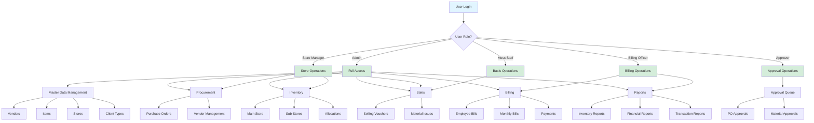

---

## 2. Master Data Setup Flow

```mermaid
flowchart TD
    Start([Start: System Setup]) --> A[Login as Admin]
    A --> B[Navigate to Mess Module]
    B --> C{Setup What?}
    
    C -->|Vendors| D[Create Vendor]
    D --> D1[Enter Name, Contact]
    D1 --> D2[Enter Phone, Email]
    D2 --> D3[Enter Address]
    D3 --> D4[Set Status Active]
    D4 --> D5[Save Vendor]
    D5 --> VIM[Create Vendor-Item Mapping]
    
    C -->|Items| E[Create Item Category]
    E --> E1[Enter Category Name]
    E1 --> E2[Set Status]
    E2 --> E3[Save Category]
    E3 --> F[Create Item Subcategory]
    F --> F1[Select Category]
    F1 --> F2[Enter Item Details]
    F2 --> F3[Item Name, Code]
    F3 --> F4[Unit of Measurement]
    F4 --> F5[Standard Cost]
    F5 --> F6[Save Item]
    F6 --> VIM
    
    VIM --> VIM1{Mapping Type?}
    VIM1 -->|Category| VIM2[Map Vendor to Category]
    VIM1 -->|Subcategory| VIM3[Map Vendor to Item]
    VIM2 --> G
    VIM3 --> G
    
    C -->|Stores| G[Create Main Store]
    G --> G1[Enter Store Name]
    G1 --> G2[Enter Store Code]
    G2 --> G3[Enter Location]
    G3 --> G4[Set Status]
    G4 --> G5[Save Store]
    G5 --> H[Create Sub-Store]
    H --> H1[Enter Sub-Store Name]
    H1 --> H2[Enter Sub-Store Code]
    H2 --> H3[Set Status]
    H3 --> H4[Save Sub-Store]
    H4 --> I
    
    C -->|Client Types| I[Create Client Types]
    I --> I1[Add Employee Type Clients]
    I1 --> I2[Add OT Type Clients]
    I2 --> I3[Add Course Type Clients]
    I3 --> I4[Add Other Type Clients]
    I4 --> J[Setup Complete]
    
    J --> End([Master Data Ready])
    
    style Start fill:#e3f2fd
    style End fill:#c8e6c9
    style D5 fill:#fff9c4
    style F6 fill:#fff9c4
    style G5 fill:#fff9c4
    style H4 fill:#fff9c4
    style J fill:#c8e6c9
```

---

## 3. Purchase Order Complete Flow

```mermaid
flowchart TD
    Start([Start: Create Purchase Order]) --> A[Navigate to Purchase Orders]
    A --> B[Click Add New PO Button]
    B --> C[Modal Opens]
    C --> D[Auto-generate PO Number]
    D --> E[Select Vendor from Dropdown]
    E --> E1{Vendor Mapping Exists?}
    E1 -->|Yes| E2[Load Vendor-Mapped Items]
    E1 -->|No| E3[Load All Items]
    E2 --> F
    E3 --> F
    F[Select Store Destination]
    F --> G[Enter PO Date]
    G --> H[Enter Delivery Date Optional]
    H --> I[Enter Payment Code]
    I --> J[Enter Delivery Address]
    J --> K[Enter Contact Number]
    K --> L[Add Items Section]
    
    L --> M[Click Add Item Row]
    M --> N[Select Item from Dropdown]
    N --> O[Enter Quantity]
    O --> P[Enter Unit Price]
    P --> Q[Enter Tax Percentage]
    Q --> R[Auto-calculate Line Total]
    R --> S{Add More Items?}
    S -->|Yes| M
    S -->|No| T[Calculate Grand Total]
    
    T --> U[Enter Remarks Optional]
    U --> V[Click Save Button]
    V --> W[Validate Form]
    W --> X{Validation Pass?}
    X -->|No| Y[Show Validation Errors]
    Y --> W
    X -->|Yes| Z[Start Database Transaction]
    
    Z --> AA[Create PO Master Record]
    AA --> AB[Status = Approved Auto]
    AB --> AC[Set Created By = Current User]
    AC --> AD[Loop Through Items]
    AD --> AE[Create PO Item Record]
    AE --> AF{More Items?}
    AF -->|Yes| AD
    AF -->|No| AG[Commit Transaction]
    
    AG --> AH[Update Store Inventory]
    AH --> AI[Add Purchased Quantities to Store]
    AI --> AJ[Close Modal]
    AJ --> AK[Show Success Message]
    AK --> AL[Refresh DataTable]
    AL --> AM[PO Appears in List]
    AM --> End([PO Created Successfully])
    
    style Start fill:#e3f2fd
    style End fill:#c8e6c9
    style AB fill:#fff9c4
    style AG fill:#fff9c4
    style AI fill:#fff9c4
    style Y fill:#ffcdd2
```

---

## 4. Store Allocation Flow

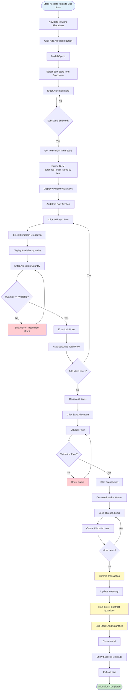

---

## 5. Material Management Flow

### 5.1 Main Selling Voucher Flow

```mermaid
flowchart TD
    Start([Start: Create Selling Voucher]) --> A[Navigate to Material Management]
    A --> B[Click Add Selling Voucher]
    B --> C[Modal Opens]
    C --> D[Select Store Main or Sub]
    D --> E{Store Type?}
    E -->|Main Store| E1[Get Items from Purchase Orders]
    E -->|Sub-Store| E2[Get Items from Allocations]
    E1 --> F
    E2 --> F
    
    F[Select Payment Type]
    F --> G{Payment Type?}
    G -->|Cash| H[Payment = 0]
    G -->|Credit| I[Payment = 1]
    G -->|Online| J[Payment = 2]
    H --> K
    I --> K
    J --> K
    
    K[Select Client Type]
    K --> L{Client Type?}
    L -->|Employee| M[Client Type = 1]
    L -->|OT| N[Client Type = 2]
    L -->|Course| O[Client Type = 3]
    L -->|Other| P[Client Type = 4]
    
    M --> M1[Load Employee List]
    M1 --> M2[Select Employee]
    M2 --> Q
    
    N --> N1[Load Course List]
    N1 --> N2[Select Course]
    N2 --> N3[AJAX: Load Students by Course]
    N3 --> N4[Select Student]
    N4 --> Q
    
    O --> O1[Enter Client Name Manually]
    O1 --> Q
    
    P --> P1[Load Client Type Master]
    P1 --> P2[Select Client]
    P2 --> Q
    
    Q[Enter Issue Date]
    Q --> R[Load Available Items for Store]
    R --> S[Display Items with Quantities]
    S --> T[Add Item Row]
    
    T --> U[Select Item]
    U --> V[Show Available Quantity]
    V --> W[Enter Issue Quantity]
    W --> X{Quantity <= Available?}
    X -->|No| Y[Error: Insufficient Stock]
    Y --> W
    X -->|Yes| Z[Enter Rate]
    Z --> AA[Auto-calculate Amount]
    AA --> AB{Add More Items?}
    AB -->|Yes| T
    AB -->|No| AC[Calculate Total Amount]
    
    AC --> AD[Enter Remarks Optional]
    AD --> AE[Click Create Button]
    AE --> AF[Validate All Fields]
    AF --> AG{Valid?}
    AG -->|No| AH[Show Errors]
    AH --> AF
    AG -->|Yes| AI[Start Transaction]
    
    AI --> AJ[Create Kitchen Issue Master]
    AJ --> AK[Status = Approved Default]
    AK --> AL[Kitchen Issue Type = 1]
    AL --> AM[Loop Through Items]
    AM --> AN[Create Kitchen Issue Item]
    AN --> AO[Store Item Details]
    AO --> AP{More Items?}
    AP -->|Yes| AM
    AP -->|No| AQ[Commit Transaction]
    
    AQ --> AR[Close Modal]
    AR --> AS[Success Message]
    AS --> AT[Refresh List]
    AT --> AU{Send for Approval?}
    AU -->|Yes| AV[Change Status to Processing]
    AV --> AW[Notify Approver]
    AW --> End1([Sent for Approval])
    AU -->|No| End2([Voucher Created])
    
    style Start fill:#e3f2fd
    style End1 fill:#fff3e0
    style End2 fill:#c8e6c9
    style Y fill:#ffcdd2
    style AH fill:#ffcdd2
    style AK fill:#fff9c4
    style AQ fill:#fff9c4
```

### 5.2 Client Type Selection Detail

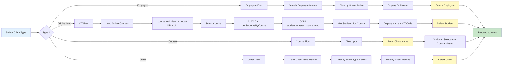

---

## 6. Approval Workflow

```mermaid
flowchart TD
    Start([Start: Material Request Created]) --> A{Auto-Approved?}
    A -->|Yes| End1([No Approval Needed])
    A -->|No| B[User Clicks Send for Approval]
    
    B --> C[Update Status to Processing]
    C --> D[Status = 1]
    D --> E[Set Modified By]
    E --> F[Save Changes]
    F --> G[Trigger Notification]
    G --> H[Notify Approver Role Users]
    H --> I[Approver Receives Notification]
    
    I --> J[Approver Logs In]
    J --> K[Navigate to Material Management Approvals]
    K --> L[View Pending Requests]
    L --> M[Filter: Status = Processing]
    M --> N[Display List of Requests]
    N --> O[Click on Request]
    O --> P[View Details Modal]
    
    P --> Q[Review Requested Items]
    Q --> R[Check Quantities]
    R --> S[Verify Client Information]
    S --> T[Check Available Stock]
    T --> U{Decision?}
    
    U -->|Approve| V[Click Approve Button]
    V --> W[Enter Approval Remarks Optional]
    W --> X[Confirm Approval]
    X --> Y[Update Status = Approved]
    Y --> Z[Status = 2]
    Z --> AA[Set Approved By]
    AA --> AB[Set Approved At]
    AB --> AC[Save Changes]
    AC --> AD[Trigger Approval Notification]
    AD --> AE[Notify Requester]
    AE --> AF[Update Inventory]
    AF --> AG[Deduct Items from Store]
    AG --> End2([Approved & Processed])
    
    U -->|Reject| AH[Click Reject Button]
    AH --> AI[Enter Rejection Reason Required]
    AI --> AJ{Reason Provided?}
    AJ -->|No| AI
    AJ -->|Yes| AK[Confirm Rejection]
    AK --> AL[Update Status = Rejected]
    AL --> AM[Status = 3]
    AM --> AN[Store Rejection Reason]
    AN --> AO[Save Changes]
    AO --> AP[Trigger Rejection Notification]
    AP --> AQ[Notify Requester]
    AQ --> AR[No Inventory Changes]
    AR --> End3([Rejected])
    
    style Start fill:#e3f2fd
    style End1 fill:#c8e6c9
    style End2 fill:#c8e6c9
    style End3 fill:#ffcdd2
    style Y fill:#fff9c4
    style AG fill:#fff9c4
    style AL fill:#ffcdd2
```

---

## 7. Billing & Payment Flow

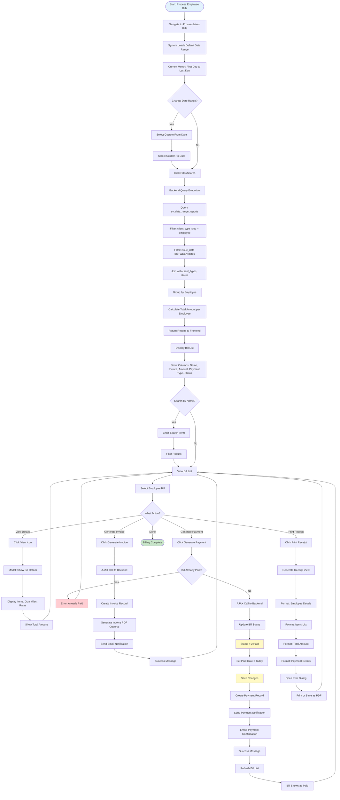

---

## 8. Client Type Selection Flow

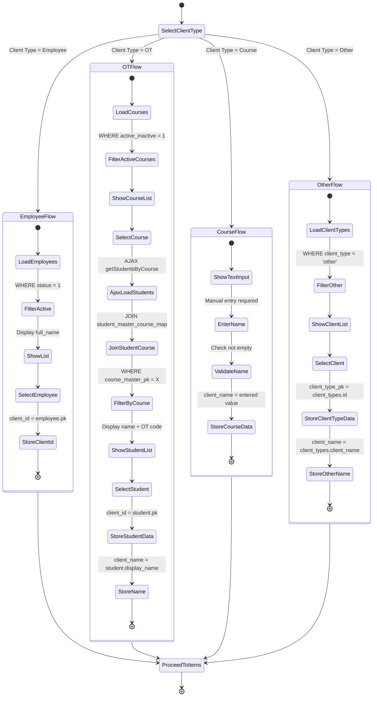

---

## 9. Data Flow Architecture

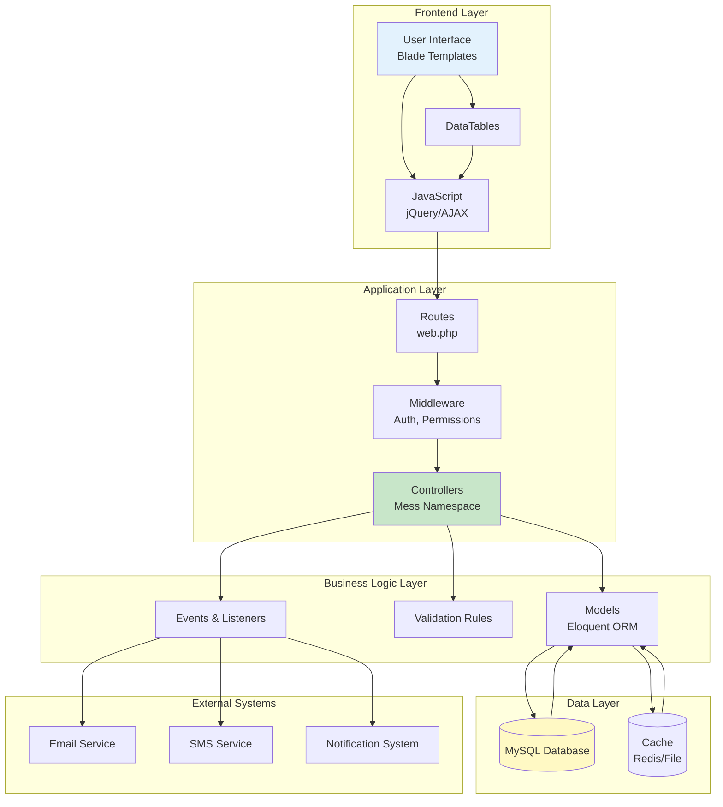

---

## 10. Complete Purchase to Sale Cycle

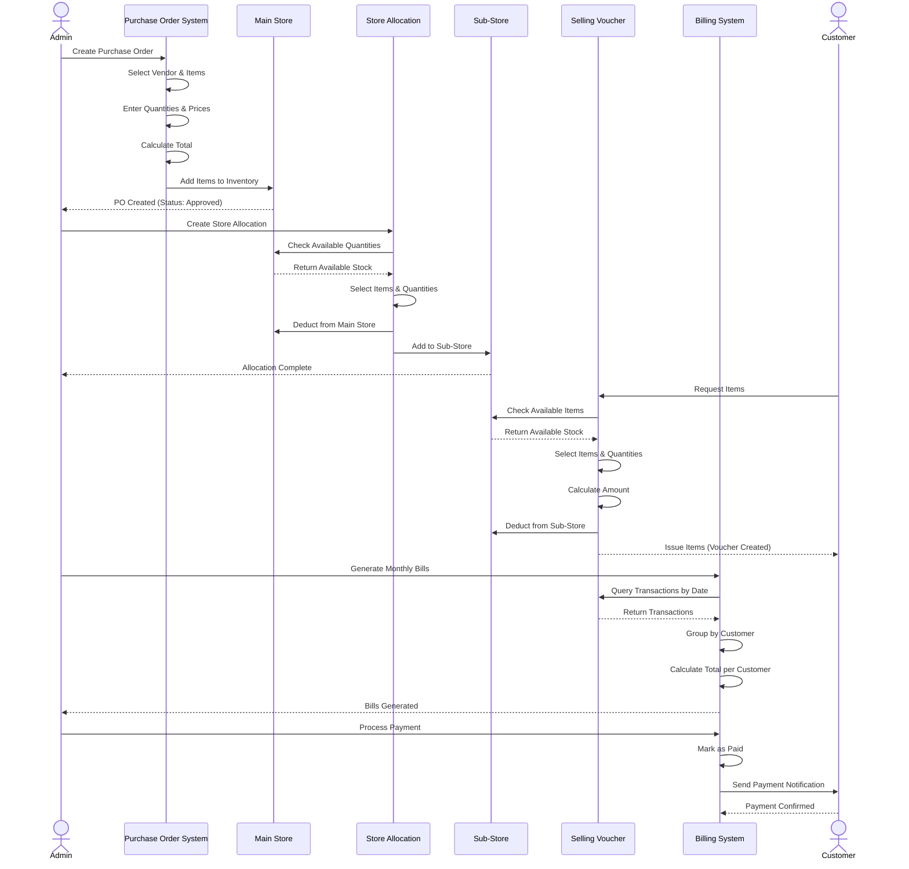

---

## 11. Inventory Management Flow

```mermaid
graph LR
    subgraph "Inbound Flow"
        A[Purchase Order] --> B[Vendor Delivers]
        B --> C[Goods Receipt]
        C --> D[Quality Check]
        D --> E{Quality OK?}
        E -->|Yes| F[Update Main Store +Qty]
        E -->|No| G[Return to Vendor]
        G --> A
    end
    
    subgraph "Internal Transfer"
        F --> H[Store Allocation Decision]
        H --> I[Select Sub-Store]
        I --> J[Allocate Quantities]
        J --> K[Update Main Store -Qty]
        K --> L[Update Sub-Store +Qty]
    end
    
    subgraph "Outbound Flow"
        L --> M[Customer Request]
        M --> N[Create Selling Voucher]
        N --> O[Check Sub-Store Stock]
        O --> P{Stock Available?}
        P -->|Yes| Q[Issue Items]
        Q --> R[Update Sub-Store -Qty]
        R --> S[Generate Bill]
        P -->|No| T[Stock Out Alert]
        T --> H
    end
    
    subgraph "Return Flow"
        S --> U{Items Returned?}
        U -->|Yes| V[Record Return]
        V --> W[Update Sub-Store +Qty]
        W --> X[Adjust Bill]
        U -->|No| Y[Transaction Complete]
    end
    
    F -.->|Low Stock Alert| Z[Reorder Point]
    Z -.-> A
    
    style F fill:#c8e6c9
    style L fill:#c8e6c9
    style R fill:#fff9c4
    style T fill:#ffcdd2
    style G fill:#ffcdd2
```

---

## 12. Permission Check Flow

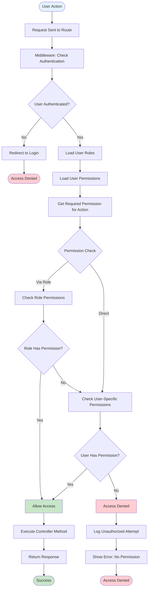

---

## 13. Report Generation Flow

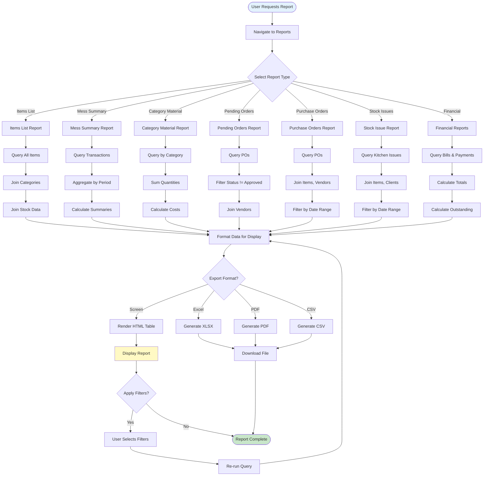

---

## 14. Error Handling Flow

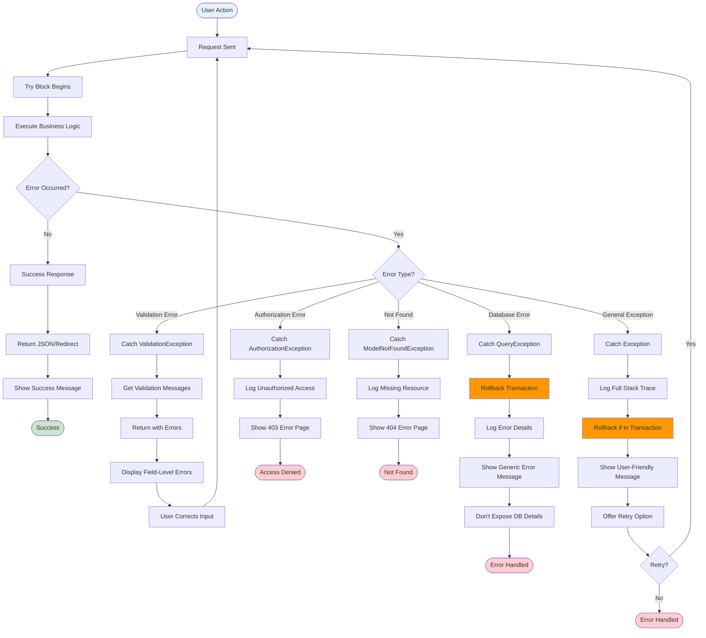

---

## 15. System Integration Diagram

```mermaid
graph TB
    subgraph "Mess Module Core"
        MM[Mess Module]
    end
    
    subgraph "Internal Integrations"
        EM[Employee Master]
        SM[Student Master]
        CM[Course Master]
        FM[Faculty Master]
        DM[Department Master]
        UM[User Management]
        RM[Role Management]
    end
    
    subgraph "External Services"
        ES[Email Service<br/>SMTP]
        SS[SMS Gateway]
        PS[Payment Gateway]
        AS[Accounting System]
    end
    
    subgraph "Reporting & Analytics"
        RS[Report Server]
        DS[Dashboard Service]
        EX[Export Service]
    end
    
    MM --> EM
    MM --> SM
    MM --> CM
    MM --> FM
    MM --> DM
    MM --> UM
    MM --> RM
    
    EM -.->|Employee Data| MM
    SM -.->|Student Data| MM
    CM -.->|Course Data| MM
    
    MM --> ES
    MM --> SS
    MM --> PS
    MM -.->|Financial Data| AS
    
    MM --> RS
    MM --> DS
    MM --> EX
    
    RS -.->|Report Data| MM
    DS -.->|Analytics Data| MM
    
    style MM fill:#4caf50,color:#fff
    style EM fill:#2196f3,color:#fff
    style SM fill:#2196f3,color:#fff
    style CM fill:#2196f3,color:#fff
    style ES fill:#ff9800,color:#fff
    style SS fill:#ff9800,color:#fff
    style PS fill:#ff9800,color:#fff
    style AS fill:#ff9800,color:#fff
    style RS fill:#9c27b0,color:#fff
    style DS fill:#9c27b0,color:#fff
```

---

## Conclusion

These flowcharts provide a visual representation of all major workflows in the Mess Module. They can be rendered using Mermaid-compatible tools for presentations, documentation, or training purposes.

For the complete textual documentation, refer to `MESS_MODULE_WORKFLOW.md`.

---

**Document End**
