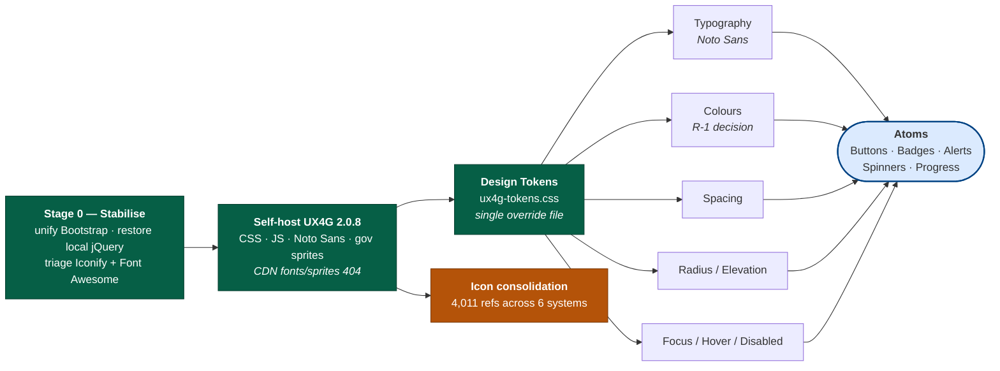
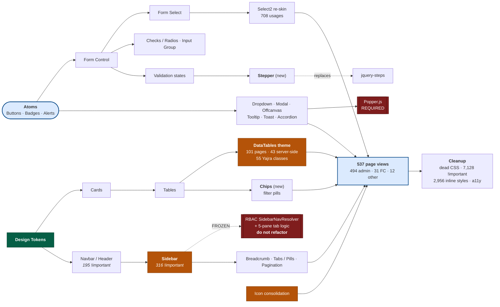

# Sargam 2.0 → UX4G Design System — Technical Migration Blueprint

**Prepared for:** LBSNAA / Sargam 2.0 development team
**Scope:** Frontend architecture and reusable components only. No backend, route, controller, API, schema or business-logic change.
**Audit basis:** Static analysis of the working tree at branch `.invalid` (HEAD `60715da05`), plus live inspection of the UX4G CDN artefacts.

> **Evidence rule applied throughout.** Every number in this document was measured from the codebase or downloaded from `cdn.ux4g.gov.in`. Where a fact could not be confirmed it is explicitly tagged **`Needs Code Inspection`** rather than estimated.

---

## 1. Executive Summary

### 1.1 The headline finding

**UX4G v2.0.8 is a rebranded recompilation of Bootstrap 5.3 — not a different framework.** This was verified by downloading and inspecting the actual CDN artefacts:

| Probe | Result | Implication |
|---|---|---|
| `cdn.ux4g.gov.in/UX4G@2.0.8/js/ux4g.min.js` header | `UX4G v2.0.8 … Licensed under MIT` | Distinct product |
| UMD export in that file | `(t=globalThis…).bootstrap = e(t.Popper)` | **Registers the global as `bootstrap`**, not `UX4G` |
| Event namespaces in that file | `.bs.modal .bs.dropdown .bs.collapse .bs.tab .bs.offcanvas .bs.toast .bs.tooltip .bs.popover .bs.carousel .bs.scrollspy .bs.alert .bs.button .bs.backdrop` | Identical to Bootstrap 5 |
| `ux4g-min.css` custom properties | `--bs-primary`, `--bs-body-bg`, `--bs-border-radius`, … | **Bootstrap's `--bs-*` token namespace, not `--ux4g-*`** |
| Class surface in `ux4g-min.css` | `.btn-primary .card-body .form-control .form-select .form-check-input .modal-dialog .offcanvas .accordion-button .nav-tabs .dropdown-menu .breadcrumb .pagination .badge .toast .tooltip .popover .carousel .progress .spinner-border .list-group .input-group .navbar` all present | Full Bootstrap component parity |
| Grid classes present | 60 distinct `.col-{bp}-{n}` | Bootstrap grid, unchanged |
| Spacing utilities present | 84 distinct `.{m,p}{t,b,s,e,x,y}-{0..5}` | Bootstrap spacing scale, unchanged |
| Breakpoints | 576 / 768 / 992 / 1200 / 1400 px | Identical to Bootstrap 5 |
| Documented modal markup | `data-bs-toggle="modal"`, `data-bs-dismiss="modal"`, `.modal-dialog-centered` | Identical attribute contract |

**Consequence:** the migration is **not** a component rewrite. The 2,202 `btn btn-*`, 2,288 `card`, 1,697 `form-control` and 350 `data-bs-toggle` usages in this codebase **do not need to be renamed**. This inverts the normal cost model of a design-system migration.

### 1.2 What the project actually costs

The expensive work is *not* the components. It is four things:

1. **Reconciling ~1.7 MB of accumulated custom CSS** (7,128 `!important` declarations) that currently overrides the existing Bootstrap theme and will fight the UX4G theme identically.
2. **A brand-colour decision**: the portal's `--bs-primary` is `#004384` (LBSNAA navy); UX4G ships `#613AF5` (violet). This is a governance decision, not a technical one, and it gates the entire visual sprint plan.
3. **Consolidating four coexisting icon systems** into one.
4. **Visual QA across 494 admin pages** — the dominant line item.

### 1.3 Recommended strategy

**Token-overlay adoption, not a rip-and-replace.** Because the class contract is identical, UX4G can be introduced as the *base* stylesheet under the existing theme, with the project's overrides progressively deleted rather than rewritten. This preserves a working application at every commit and makes rollback a one-line layout change.

### 1.4 Headline numbers

| Metric | Value |
|---|---|
| Blade files | 853 |
| Page views (files with `@extends`) | 537 |
| Pages on `admin.layouts.master` | 494 (92 %) |
| Custom + theme CSS shipped | ~1.70 MB (`public/css` 505 KB + `admin_assets/css` 1,198 KB) |
| `!important` declarations | 7,128 |
| Inline `<style>` blocks | 379 across 319 files |
| Inline `style="…"` attributes | 2,956 |
| Vendored JS libraries | 35 |
| jQuery `$(…)` call sites in Blade | 5,851 across 192 files |
| Distinct external CDN hosts | 25 |
| **Estimated effort (P50)** | **1,572 h** (range 1,180 – 2,100) |
| **Recommended team** | 3 frontend + 1 QA + 0.4 designer, **~5 months** |

### 1.5 Three risks that must be decided before Sprint 1

| # | Decision | Why it blocks |
|---|---|---|
| R-1 | **Brand colour**: adopt UX4G violet `#613AF5`, or retain LBSNAA navy `#004384` as an approved token override? | Determines whether Sprint 2–4 is a re-theme or a no-op. Affects every screenshot in UAT. |
| R-2 | **Version pinning**: only `UX4G@2.0.8` resolves on the CDN (`2.1.0`, `3.0.0`, `latest` all return **404**). The docs advertise "v3.0". | We must either pin 2.0.8 and self-host, or obtain 3.x from NeGD. |
| R-3 | **Self-hosting**: the CDN's `ux4g-min.css` declares `@font-face` at `../fonts/NotoSans-*.woff2` — **every one of those URLs returns 404**, as do the five `../img/*-icons.svg` sprites. | Consuming UX4G purely by CDN yields **no Noto Sans and no gov icon sprites**. Self-hosting is mandatory, not optional. |

---

## 2. Current Architecture

### 2.1 Stack (confirmed)

| Layer | Technology | Version | Source |
|---|---|---|---|
| Framework | Laravel | ^9.0 | `composer.json` |
| PHP | | ^8.0 | `composer.json` |
| Templating | Blade | — | 853 files |
| CSS framework | Bootstrap | **5.3.2** (bundled) / **5.3.3** (`node_modules`) / **5.3.6** (CDN, timetable layout) | see §2.4 |
| Build | Laravel Mix (webpack) | ^6.0.6 | `package.json`; a `vite.config.js` also exists but Mix is what `npm run prod` invokes |
| CSS preprocessor | Sass | ^1.56.1 | `resources/sass/` |
| DOM library | jQuery | 3.7.1 (CDN) | `public/js/jquery-3.7.1.min.js` is **0 bytes** — jQuery is served from `code.jquery.com` |
| Admin theme | Modernize-family Bootstrap 5 admin template | — | `public/admin_assets/` |
| Server-side tables | Yajra DataTables | ^10.0 | 55 PHP DataTable classes in `app/` |
| Permissions | spatie/laravel-permission | ^6.16 | drives the dynamic RBAC sidebar |

### 2.2 Layout inheritance

| Layout | Pages | Lines | Notes |
|---|---:|---:|---|
| `admin.layouts.master` | **494** | 1,318 | The primary target. Renders a 5-tab pane system with server-resolved RBAC sidebar. |
| `fc.layouts.master` | 31 | 25 | Clean, modern, already has a `skip-link` target and `<main id="content" tabindex="-1">`. Best-practice reference. |
| `layouts.app` | 7 | — | Laravel/UI auth scaffolding. |
| `admin.layouts.timetable` | 4 | — | **Standalone** — loads its own Bootstrap 5.3.6 from jsDelivr. |
| `faculty.layouts.master` | 1 | 674 | Near-dead; consider retiring. |

> **Architectural note (from `master.blade.php:62-91`):** the master layout resolves which of five `@section` panes a page actually populated, and renders it into the active RBAC tab. This coupling between the sidebar resolver and the content pane is **fragile and must not be refactored during the UX4G migration** — it is orthogonal to styling. Treat it as frozen.

### 2.3 Stylesheet load order (`admin/layouts/pre_header.blade.php`)

```
1. admin_assets/css/styles.css              ← 1,002 KB, 5,579 !important  (theme + Bootstrap build)
2. css/custom.css                           ← 69.7 KB,   209 !important
3. css/admin-header.css                     ← 22.9 KB,   195 !important
4. admin_assets/css/dashboard-enhanced.css
5. datatables.net-bs5 css  (local)
6. datatables responsive 2.5.0  (CDN)
7. datatables buttons 2.4.2   (CDN)
8. admin_assets/css/material-icons-local.css
9. css/spacing-system.css                   ← 4.8 KB,    42 !important
10. bootstrap-icons 1.11.3    (CDN)
11. css/breadcrumb.css
12. css/sidebar-menu-enhanced.css
13. admin_assets/css/sidebar-modern.css     ← 22.2 KB,   277 !important
14. css/sargam-app.css                      ← 50.9 KB,    32 !important  ← the sanctioned design-system file
```

**This ordering is the crux of the migration.** UX4G must be inserted at position 0 (or replace position 1), and layers 2–13 must be progressively deleted. `sargam-app.css` is the correct long-term home for everything that survives.

### 2.4 Version drift (defect, pre-existing)

Three Bootstrap versions are live in one application:

| Where | Version |
|---|---|
| `public/admin_assets/libs/bootstrap/dist/js/bootstrap.bundle.min.js` | 5.3.2 |
| `node_modules/bootstrap` | 5.3.3 |
| `admin/layouts/timetable.blade.php:305` (jsDelivr) | 5.3.6 |

Resolve this **before** Sprint 1; otherwise migration bugs will be indistinguishable from version-skew bugs.

---

## 3. Bootstrap Inventory

### 3.1 Component classes in Blade

Counts are `class="…"` occurrences across `resources/views/**/*.blade.php`.

| Bootstrap component | Occurrences | Rank |
|---|---:|---|
| `card` | 2,288 | 1 |
| `btn btn-*` | 2,202 | 2 |
| `form-control` | 1,697 | 3 |
| `table` | 997 | 4 |
| `form-select` | 861 | 5 |
| `form-check` | 811 | 6 |
| `card-body` | 789 | 7 |
| `badge` | 600 | 8 |
| `alert alert-*` | 384 | 9 |
| `modal-dialog` | 207 | 10 |
| `modal fade` | 207 | 11 |
| `breadcrumb` | 135 | 12 |
| `spinner-*` | 95 | 13 |
| `collapse` | 94 | 14 |
| `input-group` | 92 | 15 |
| `dropdown-menu` | 59 | 16 |
| `navbar` | 55 | 17 |
| `pagination` | 48 | 18 |
| `tooltip` | 40 | 19 |
| `accordion` | 37 | 20 |
| `offcanvas` | 27 | 21 |
| `nav-pills` | 27 | 22 |
| `progress` | 26 | 23 |
| `toast` | 17 | 24 |
| `list-group` | 14 | 25 |
| `nav-tabs` | 10 | 26 |
| `carousel` | 4 | 27 |
| `popover` | **0** | — |

### 3.2 Bootstrap JS trigger attributes

| Attribute | Occurrences |
|---|---:|
| `data-bs-dismiss` | 567 |
| `data-bs-toggle` (total) | 350 |
| ├ `="modal"` | 102 |
| ├ `="tab"` | 81 |
| ├ `="dropdown"` | 61 |
| ├ `="collapse"` | 56 |
| ├ `="tooltip"` | 33 |
| ├ `="pill"` | 9 |
| └ `="offcanvas"` | 7 |
| `data-bs-target` | 189 |
| `data-bs-backdrop` | 66 |
| `data-bs-keyboard` | 31 |
| `data-bs-auto-close` | 21 |
| `data-bs-placement` | 15 |
| `data-bs-theme` | 9 |
| `data-bs-parent` | 4 |
| `data-bs-custom-class` | 4 |
| others (`popper`, `title`, `ride`, `pause`, `original-title`, `interval`, `display`) | 1 each |

### 3.3 Grid

| Class family | Occurrences |
|---|---:|
| `col-md-*` | 2,352 |
| `row` | 1,330 |
| `container` | 568 |
| `container-fluid` | 478 |
| `g-3` | 378 |
| `col-lg-*` | 342 |
| `col-sm-*` | 301 |
| `col-xl-*` | 76 |
| `gy-*` | 3 |
| `gx-*` | 0 |

> `col-md-*` outnumbers `col-lg-*` 7:1 — the layout is tuned for tablet-width and simply stretches on desktop. Not a UX4G problem, but a responsive-design debt worth logging.

### 3.4 Icon systems — **four in production**

| System | Occurrences | Delivery |
|---|---:|---|
| Bootstrap Icons (`bi bi-`) | 1,281 | jsDelivr CDN (1.11.3 in master, 1.10.5 in timetable) |
| Material Symbols (`material-symbols`) | 1,111 | `@fontsource-variable`, local CSS |
| Material Icons (`material-icons`) | 1,044 | `admin_assets/css/material-icons-local.css` |
| Iconify (`iconify`) | 397 | **Needs Code Inspection** — no Iconify runtime found in `admin_assets/libs/`; may be dead markup |
| Font Awesome (`fas fa-`, `fa fa-`) | 169 | **Needs Code Inspection** — no FA stylesheet found in the load order; these icons may be silently rendering as blank boxes today |
| Tabler (`ti ti-`) | 9 | vestigial |

**Two of six systems have no confirmed stylesheet.** This is a live rendering bug independent of UX4G and should be triaged in Sprint 0.

### 3.5 Custom CSS

| File | Size | `!important` |
|---|---:|---:|
| `admin_assets/css/styles.css` | 1,002,558 B | **5,579** |
| `css/custom.css` | 69,744 B | 209 |
| `css/calendar-admin.css` | 62,268 B | 206 |
| `css/sargam-app.css` | 50,943 B | 32 |
| `css/notice-memo-discipline.css` | 45,858 B | — |
| `css/dashboard-main.css` | 39,944 B | 32 |
| `admin_assets/css/original/accesibility-style_v1.css` | 39,903 B | 16 |
| `admin_assets/css/accesibility-style_v1.css` | 36,182 B | — |
| `admin_assets/css/plugins/datatable.min.css` | 34,566 B | 18 |
| `css/course-repository-admin.css` | 26,847 B | 54 |
| `admin_assets/css/sidebar-modern.css` | 22,225 B | 277 |
| `css/admin-header.css` | 22,850 B | 195 |
| `css/mobile-responsive.css` | 22,110 B | 52 |
| … 20 further files in `public/css` | | |
| **Total** | **~1.70 MB** | **7,128** |

Plus **379 inline `<style>` blocks** in 319 Blade files and **2,956 inline `style="…"` attributes** — neither cacheable nor overridable by a design system.

### 3.6 Third-party libraries (35 vendored)

`@claviska` · `apexcharts` · `block-ui` · `bootstrap` · `bootstrap-datepicker` · `bootstrap-switch` · `bootstrap-tree` · `datatables.net` · `datatables.net-bs5` · `daterangepicker` · `dragula` · `dropzone` · `fullcalendar` · `inputmask` · `jquery-asColor` · `jquery-asColorPicker` · `jquery-asGradient` · `jquery-raty-js` · `jquery-steps` · `jquery-ui` · `jquery-validation` · `jquery.repeater` · `jvectormap` · `magnific-popup` · `nestable` · `nouislider-orxe` · `owl.carousel` · `prismjs` · `quill` · `select2` · `simplebar` · `sweetalert2` · `tinymce` · `typeahead.js` · `wnumb`

### 3.7 External CDN dependencies (25 hosts)

| Host | References | Risk for a government portal |
|---|---:|---|
| `cdn.jsdelivr.net` | 232 | **High** — third-party, non-GoI, single point of failure |
| `cdn.datatables.net` | 35 | High |
| `fonts.googleapis.com` | 27 | High — GIGW/data-localisation concern |
| `code.jquery.com` | 19 | **Critical** — jQuery is served entirely off-site; local copy is 0 bytes |
| `cdnjs.cloudflare.com` | 19 | High |
| `fonts.gstatic.com` | 13 | High |
| `upload.wikimedia.org`, `i.pinimg.com`, `assets.codepen.io`, `front.codes` | 18 | **Unacceptable** — user-content hosts referenced from a government portal |
| Laravel marketing domains (`laravel.com`, `forge`, `vapor`, `nova`, `envoyer`, `laracasts`, `laravel-news`, `herd`) | 8 | Dead scaffolding in `welcome.blade.php` — delete |
| GoI hosts (`lbsnaa.gov.in`, `india.gov.in`, `negd.gov.in`, `digitalindiacorporation.in`) | 20 | Acceptable |

**Recommendation:** self-hosting all frontend assets is a prerequisite for GIGW compliance and should be folded into this migration as Sprint 1 work. It is also the mechanism by which UX4G's missing fonts/sprites get fixed (§1.5 R-3).

---

## 4. UX4G Mapping Matrix

### 4.1 What UX4G v2.0.8 actually ships

| Category | Contents |
|---|---|
| **Bootstrap-parity components** | Accordion, Alerts, Badge, Breadcrumb, Button Group, Buttons, Card, Carousel, Close Button, Collapse, Dropdowns, List Groups, Modal, Navbar, Navs & Tabs, Offcanvas, Pagination, Placeholders, Popovers, Progress, Scrollspy, Spinners, Toasts, Tooltips |
| **UX4G-additional** | **Chips** (`.chip .chips .chips-input-wrapper .chips-placeholder .chips-transition .chip-opacity`), **Stepper** (25 classes incl. `.stepper-vertical .stepper-mobile .stepper-head-check .stepper-progress-bar .stepper-invalid`), **Search**, **Date & Time Picker** |
| **Grid** | Columns, Containers, CSS Grid, Gutters, Breakpoints, Z-index — Bootstrap-identical |
| **Forms** | Form Control, Floating Labels, Checks & Radios, Input Group, Select, Range, Validation |
| **Utilities** | Background, Borders, Colors, Display, Flex, Spacing, Text, Sizing, Shadows |
| **Helpers** | Color & Background, Position, Stacks, Text Truncation, Visually Hidden |
| **Dependency** | Popper.js only. **No Bootstrap. No jQuery.** |

### 4.2 The mapping matrix

Legend — **Complexity**: Trivial = class contract identical, only visual reconciliation; Low ≤ 1 d; Medium 1–3 d; High > 3 d.

| # | Current (Bootstrap 5.3) | UX4G equivalent | Complexity | Breaking changes | Dependencies | A11y improvement | Effort |
|---|---|---|---|---|---|---|---|
| 1 | Card ×2,288 | Card | **Trivial** | None — classes identical | None | Neutral | 4 h (visual reconcile) |
| 2 | Buttons ×2,202 | Buttons + `.ripple-button` | **Trivial** | None. Tonal variants **Needs Code Inspection** | None | Focus ring meets 2.4.7 | 8 h |
| 3 | Form Control ×1,697 | Form Control | **Low** | Height/padding differ → 40 dense forms need reflow QA | None | Better contrast on `:disabled` | 24 h |
| 4 | Table ×997 | *(no UX4G table component)* — Bootstrap `.table-*` present in `ux4g-min.css` | **Low** | None | DataTables theme | Needs manual `<caption>`/`scope` | 16 h |
| 5 | Form Select ×861 | Select | **Low** | Select2 re-skin needed (§8) | select2 | Neutral | 16 h |
| 6 | Form Check ×811 | Checks & Radios | **Trivial** | None | None | Larger hit target | 6 h |
| 7 | Badge ×600 | Badge | **Trivial** | Palette shift only | None | Neutral | 3 h |
| 8 | Alert ×384 | Alerts | **Trivial** | None | None | Add `role="alert"` (54 sites lack it) | 6 h |
| 9 | Modal ×207 | Modal | **Trivial** | `data-bs-*` + `.bs.modal` events identical; JS global stays `bootstrap` | Popper | Focus trap already correct | 8 h |
| 10 | Breadcrumb ×135 | Breadcrumb | **Low** | Custom `breadcrumb.css` (8.2 KB) must be retired | `components/breadcrum.blade.php` | `aria-current="page"` | 8 h |
| 11 | Spinners ×95 | Spinners | **Trivial** | None | None | Add `role="status"` | 2 h |
| 12 | Collapse ×94 | Collapse | **Trivial** | None | None | `aria-expanded` present ×210 | 4 h |
| 13 | Input Group ×92 | Input Group | **Trivial** | None | None | Neutral | 4 h |
| 14 | Dropdown ×59 | Dropdowns | **Trivial** | None | **Popper** | Keyboard nav parity | 4 h |
| 15 | Navbar ×55 | Navbar | **Medium** | Custom header (`admin-header.css`, 22.9 KB / 195 `!important`) must be rebuilt on UX4G primitives | RBAC resolver | Landmark roles | 32 h |
| 16 | Pagination ×48 | Pagination | **Low** | Laravel paginator view must be republished | Laravel pagination views | `aria-label` on links | 8 h |
| 17 | Tooltip ×40 | Tooltips | **Trivial** | None | **Popper** | Tooltips are not keyboard-reachable today — fix during migration | 6 h |
| 18 | Accordion ×37 | Accordion | **Trivial** | None | None | Neutral | 3 h |
| 19 | Offcanvas ×27 | Offcanvas | **Trivial** | None | None | Focus trap | 3 h |
| 20 | Nav Pills ×27 / Tabs ×10 | Navs & Tabs | **Trivial** | None; **but** the 5-pane RBAC tab system (§2.2) is custom and frozen | Sidebar resolver | `role="tablist"` audit | 8 h |
| 21 | Progress ×26 | Progress | **Trivial** | None | None | `aria-valuenow` audit | 2 h |
| 22 | Toast ×17 | Toasts | **Low** | Global success toast is SweetAlert2-based, not BS Toast — decide whether to converge | sweetalert2 | `aria-live` | 8 h |
| 23 | List Group ×14 | List Groups | **Trivial** | None | None | Neutral | 2 h |
| 24 | Carousel ×4 | Carousel | **Trivial** | None | None | Pause control needed | 2 h |
| 25 | Popover ×0 | Popovers | **N/A** | Not used | — | — | 0 h |
| 26 | *(none)* | **Chips** — new | **Low** | Net-new capability; adopt for filter pills | None | Removable-chip labelling | 12 h |
| 27 | `components/estate-workflow-stepper` + `partials/step-indicator` + jquery-steps | **Stepper** — new | **Medium** | Replaces a jQuery plugin with CSS/JS-lite | Removes `jquery-steps` | Progress semantics | 24 h |
| 28 | Bootstrap Icons + Material Symbols + Material Icons + Iconify + FA | UX4G gov icon sprites + **one** retained icon font | **High** | 4,011 icon references; sprites 404 on CDN (§1.5 R-3) | Self-hosting | Decorative icons need `aria-hidden` | 64 h |
| 29 | daterangepicker + bootstrap-datepicker | UX4G **Date & Time Picker** | **Medium** | **Needs Code Inspection** — no `.datepicker`/`.timepicker` classes found in `ux4g-min.css`; component may be JS-only or v3-only. **Do not plan on this until verified.** | — | — | TBD |
| 30 | Custom search boxes / `dropdown-search.js` | **Search** | **Low** | 6 `.search-*` rules found in CSS | None | `role="search"` | 12 h |

### 4.3 Why "Trivial" is honest here

For rows marked Trivial the required Blade change is **zero**. `<div class="card">` is a valid UX4G card. `data-bs-toggle="modal"` is the documented UX4G API. `new bootstrap.Modal(el)` is the working constructor. The only work is confirming the new visual defaults don't break a layout — which is QA time, not development time, and is priced in §13.

---

## 5. Component-wise Migration Plan

| Component | Current usage | UX4G alternative | Files affected | Dependencies | Order | Hours | Risk | Regression risk | Testing | Rollback |
|---|---|---|---|---|---|---:|---|---|---|---|
| **Foundation / tokens** | `--bs-primary:#004384` in `styles.css` | `--bs-primary:#613AF5` (or approved override) | `pre_header.blade.php`, new `ux4g-tokens.css` | R-1 decision | 1 | 40 | **High** | **App-wide** | Full visual regression baseline | Remove one `<link>` |
| **Self-hosting + fonts** | 25 CDN hosts; jQuery off-site | Local `public/vendor/ux4g/` incl. Noto Sans + sprites | `pre_header`, `timetable`, `fc/pre_header` | R-3 | 2 | 48 | Medium | Asset 404s | Network-panel audit per layout | Revert `<link>`/`<script>` |
| **Typography** | Mixed; no single family token | Noto Sans via `--bs-body-font-family` | `ux4g-tokens.css` | Fonts self-hosted | 3 | 24 | Medium | Line-height shifts in dense tables | Screenshot diff on 20 densest pages | Token revert |
| **Spacing** | `spacing-system.css` (4.8 KB, 42 `!important`) | UX4G spacing utilities | `spacing-system.css` → delete | Tokens | 4 | 24 | Medium | Layout drift | Grid-heavy page sweep | Restore file |
| **Buttons** | 2,202 | Buttons | 0 Blade edits; theme only | Tokens | 5 | 8 | Low | Low | Visual | Token revert |
| **Forms / Inputs** | 1,697 + 861 + 811 | Form Control / Select / Checks | ~40 dense forms need reflow | Buttons | 6 | 24 | Medium | Medium | Form-submit E2E per module | Per-page CSS shim |
| **Validation** | `jquery-validation` ×12 + custom | UX4G Validation classes | `fc-form-validation.css` | Forms | 7 | 24 | Medium | **Submit-blocking** | Every validated form manually | Keep plugin |
| **Cards** | 2,288 | Card | Theme only | Tokens | 8 | 4 | Low | Low | Visual | Token revert |
| **Tables** | 997 + 101 DataTable inits | `.table-*` + DT bs5 theme | `datatable-global-ui.js`, `datatable.min.css` | Forms | 9 | 32 | **High** | **High** — see §8 | All 101 DT pages, both modes | Restore DT theme CSS |
| **Navbar / Header** | `admin-header.css` 195 `!important` | Navbar | `header.blade.php`, `admin-header.css` | Tokens | 10 | 32 | **High** | Global | Every page renders header | Restore CSS |
| **Sidebar** | `sidebar-menu-enhanced.css` + `sidebar-modern.css` (277 `!important`) + 5 JS files | Offcanvas + List Group | `admin/layouts/sidebar*`, 4 JS files | RBAC resolver — **frozen** | 11 | 48 | **Critical** | **Global** | Full RBAC matrix per role | Restore CSS+JS |
| **Breadcrumb** | 135 | Breadcrumb | `components/breadcrum.blade.php`, `breadcrumb.css` | Tokens | 12 | 8 | Low | Low | Spot-check | Restore CSS |
| **Dropdown** | 59 | Dropdowns | Theme only | Popper | 13 | 4 | Low | Low | Visual | Token revert |
| **Modal** | 207 | Modal | Theme only | Popper | 14 | 8 | Low | Low | Open/close/submit per modal | Token revert |
| **Offcanvas** | 27 | Offcanvas | Theme only | — | 15 | 3 | Low | Low | Visual | — |
| **Accordion** | 37 | Accordion | Theme only | — | 16 | 3 | Low | Low | Visual | — |
| **Tabs / Pills** | 37 | Navs & Tabs | Theme only — **RBAC pane logic frozen** | Sidebar | 17 | 8 | Medium | Medium | Tab-switch per module | — |
| **Pagination** | 48 | Pagination | Laravel paginator views | Tokens | 18 | 8 | Low | Low | Paginated list sweep | Republish old view |
| **Alerts** | 384 | Alerts | Theme only | Tokens | 19 | 6 | Low | Low | Visual | — |
| **Badges** | 600 | Badge | Theme only | Tokens | 20 | 3 | Low | Low | Visual | — |
| **Toast** | 17 + SweetAlert2 global toast | Toasts | `sargam-success-toast.js` | Decision | 21 | 8 | Medium | Medium | Success-path E2E | Keep SweetAlert2 |
| **Tooltip** | 40 | Tooltips | Theme + init | Popper | 22 | 6 | Low | Low | Hover + **keyboard** | — |
| **Popover** | 0 | Popovers | — | — | 23 | 0 | — | — | — | — |
| **Carousel** | 4 | Carousel | Theme only | — | 24 | 2 | Low | Low | Visual | — |
| **Stepper** | jquery-steps + 2 custom Blades | **Stepper** | `estate-workflow-stepper`, `step-indicator` | Forms | 25 | 24 | Medium | Medium | Estate + FC wizards E2E | Keep jquery-steps |
| **Chips** | *(none)* | **Chips** | `datatable-global-ui.js` filter pills | Tables | 26 | 12 | Low | Low | Filter behaviour | Revert |
| **Search** | `dropdown-search.js` | **Search** | `dropdown-search.js` | — | 27 | 12 | Low | Low | Search UX | Revert |
| **Date Picker** | daterangepicker ×72 | **Unverified** — see §4.2 row 29 | — | R-2 | 28 | TBD | **High** | High | — | Keep plugin |
| **Charts** | ApexCharts (516 KB) — **1 Blade** | *(none in UX4G)* | `dashboard_statistics/charts.blade.php` | Tokens | 29 | 8 | Low | Low | Chart render | — |
| **Icons** | 4,011 refs / 6 systems | Consolidate to 1 + gov sprites | ~400 Blades | Self-hosting | 30 | 64 | **High** | High | Visual sweep | Keep all fonts loaded |
| **Custom widgets** | Calendar (62 KB CSS), timetable, ID cards | Retain, re-tokenise | per §17 | Tokens | 31 | 80 | Medium | Medium | Per-widget | Per-file |
| **Page sweep** | 494 admin + 31 FC + 12 other | — | 537 views | All above | 32 | ~400 | Medium | Medium | Per-page UAT | Per-page |

---

## 6. Migration Sequence

The sequence is ordered so that **every stage leaves a shippable application**, and so that high-blast-radius work happens while the regression suite is freshest.

```
STAGE 0 — STABILISE (no UX4G yet)
  ├─ Unify Bootstrap to one version (5.3.2 / 5.3.3 / 5.3.6 → one)
  ├─ Restore local jQuery (public/js/jquery-3.7.1.min.js is 0 bytes)
  ├─ Triage Iconify (397) + Font Awesome (169) — confirm or delete
  ├─ Delete Laravel marketing CDN refs in welcome.blade.php
  └─ Establish Playwright visual-regression baseline over top 60 pages
                    ↓
STAGE 1 — FOUNDATION
  ├─ Self-host UX4G 2.0.8 (CSS, JS, Noto Sans, gov icon sprites)
  ├─ Insert ux4g-min.css at load position 0, behind existing theme
  ├─ Create public/css/ux4g-tokens.css  (single token override file)
  ├─ Decide R-1 (brand colour) and encode it here
  └─ Verify: zero visual change expected at this point
                    ↓
STAGE 2 — TOKENS      Typography → Colors → Radius → Spacing → Elevation → Focus/Hover/Disabled
                    ↓
STAGE 3 — ATOMS       Buttons → Badges → Alerts → Spinners → Progress
                    ↓
STAGE 4 — FORMS       Form Control → Select → Checks/Radios → Input Group → Floating Labels → Validation
                    ↓
STAGE 5 — SURFACES    Cards → List Groups → Tables
                    ↓
STAGE 6 — CHROME      Navbar/Header → Sidebar → Breadcrumb → Tabs/Pills   ◄── highest risk; RBAC frozen
                    ↓
STAGE 7 — OVERLAYS    Dropdown → Modal → Offcanvas → Tooltip → Toast → Accordion → Carousel
                    ↓
STAGE 8 — NEW UX4G    Chips → Stepper → Search → Date Picker (if R-2 resolves)
                    ↓
STAGE 9 — PLUGINS     DataTables → Select2 → Summernote → FullCalendar → SweetAlert2 → Dropzone
                    ↓
STAGE 10 — WIDGETS    Calendar → Timetable → Dashboard widgets → ID cards → Course repository
                    ↓
STAGE 11 — PAGES      494 admin + 31 FC + 12 other, module by module
                    ↓
STAGE 12 — CLEANUP    Delete dead CSS · purge !important · remove inline styles · a11y remediation · perf pass
```

**Rationale for the ordering.** Tokens first because in a Bootstrap-compatible system a token change propagates to *every* component for free — doing components first would mean re-doing them. Chrome (Stage 6) before plugins (Stage 9) because DataTables and Select2 render *inside* page chrome and would need re-testing anyway. Pages last because per-page fixes are only valid once the shared layer is stable.

---

## 7. Dependency Graph

Split into two views for legibility. **7.1** covers the shared foundation every component inherits; **7.2** covers the component-to-page dependencies that determine sprint ordering.

Colour key — 🟩 green = foundation (must land first) · 🟧 amber = high-risk, dedicated sprint · 🟥 red = frozen contract or hard external dependency.

### 7.1 Foundation layer



### 7.2 Component and page dependencies



**Critical path:** `Stage 0 → Self-host → Tokens → Navbar → Sidebar → Pages`. The sidebar is the longest-pole item because it couples to the frozen RBAC resolver.

---

## 8. jQuery Plugin Analysis

`$(…)` appears **5,851 times across 192 Blade files**. jQuery is not removable in this migration and should not be attempted.

| Plugin | Usage (Blade) | UX4G replacement? | Verdict | Rationale | Risk |
|---|---:|---|---|---|---|
| **DataTables** (+ `datatables.net-bs5`) | 1,587 refs · 101 pages · 43 `serverSide` · 55 Yajra PHP classes | **No** | **KEEP** | Yajra server-side pagination is backend-coupled; replacing it violates the no-backend-change constraint. Re-theme only. | **High** — `dataTables.bootstrap5` targets `.page-link`, `.form-select`, `.table`; UX4G ships all three, so the theme *should* hold, but must be verified per page. Never convert a Yajra table to custom-DOM/colVis — it breaks init. |
| **Select2** (theme `bootstrap-5`) | 708 | Partial — UX4G `Select` covers native only | **KEEP + re-skin** | Multi-select, AJAX search and tagging have no UX4G equivalent | Medium — `select2-theme.css` (5.6 KB) + `choices-theme.css` (3.1 KB) both exist; consolidate to one |
| **SweetAlert2** | 285 (`Swal`) + 25 | Partial — UX4G Modal/Toast | **KEEP** | 285 call sites; the global success toast is a documented project pattern. Converging is out of scope. | Low |
| **SimpleBar** | 257 | No | **KEEP** | Custom scrollbars in sidebar | Low |
| **daterangepicker** | 72 | **Unverified** — UX4G lists a Date & Time Picker but no `.datepicker`/`.timepicker` classes exist in `ux4g-min.css` | **KEEP pending R-2** | Do not schedule removal until the component is confirmed to exist in a self-hostable build | **High** |
| **Summernote 0.8.18** | 67 | No | **KEEP, but self-host** | Loaded from `cdn.jsdelivr.net`, **not vendored** — a CDN outage breaks every rich-text field | Medium |
| **FullCalendar** | 74 | No | **KEEP** | No UX4G calendar. 288 KB. Re-tokenise `calendar-admin.css` (62 KB) only. | Medium |
| **Dropzone** | 20 | No | **KEEP** | No UX4G file-upload component | Low |
| **jquery-validation** | 12 | Partial — UX4G Validation is CSS-state only | **KEEP** | UX4G provides `.is-valid`/`.is-invalid` styling, not validation logic | Medium |
| **ApexCharts** (516 KB) | 3 refs · **1 Blade** | No | **REVIEW — likely remove** | 516 KB shipped for one file (`dashboard_statistics/charts.blade.php`). Load it lazily on that route only. | Low |
| **jquery-steps** | 2 | **Yes — UX4G Stepper** | **REPLACE** | Genuine 1:1 replacement with better a11y | Medium |
| **TinyMCE** (428 KB) | **0** | — | **DELETE** | Zero references in Blade | None |
| **Quill** (216 KB) | **0** | — | **DELETE** | Zero references | None |
| **jQuery UI** (255 KB) | 0 direct | — | **AUDIT then delete** | **Needs Code Inspection** — may be a transitive dep of another plugin | Low |
| **jvectormap** (169 KB incl. US map) | 0 | — | **DELETE** | A US county map on an Indian government portal | None |
| **owl.carousel** (44 KB) | 0 | UX4G Carousel | **DELETE** | Zero references | None |
| **inputmask** (104 KB) | 0 | No | **DELETE** | Zero references | None |
| **nouislider** + `wnumb` | 0 | UX4G Range | **DELETE** | Zero references | None |
| **typeahead.js** (27 KB) | 0 | UX4G Search | **DELETE** | Zero references | None |
| **magnific-popup** | 0 | UX4G Modal | **DELETE** | Zero references | None |
| **prismjs** (60 KB) | 0 | — | **DELETE** | Syntax highlighting has no place in an ERP | None |
| **nestable / dragula / bootstrap-tree / bootstrap-switch / block-ui / jquery-raty-js / jquery-asColor* / @claviska / jquery.repeater** | 0–1 | — | **AUDIT then delete** | `repeater` has 1 ref — verify before removing | Low |

### 8.1 Estimated dead weight

Removing the zero-reference libraries reclaims approximately **1.4 MB** of shipped JavaScript (TinyMCE 428 KB + Quill 216 KB + jQuery UI 255 KB + jvectormap 169 KB + owl 44 KB + inputmask 104 KB + prism 60 KB + nouislider 24 KB + typeahead 27 KB + asColorPicker 34 KB + others). Fold this into Stage 12.

---

## 9. CSS Refactoring Plan

### 9.1 The problem, quantified

| Symptom | Measure |
|---|---:|
| Total shipped custom/theme CSS | ~1.70 MB |
| `!important` declarations | 7,128 |
| ↳ in `styles.css` alone | 5,579 (78 %) |
| Inline `<style>` blocks | 379 in 319 files |
| Inline `style="…"` attributes | 2,956 |
| Stylesheets in the critical path | 14 |
| Duplicate a11y stylesheets | `accesibility-style_v1.css` exists in both `css/` (36 KB) and `css/original/` (40 KB) |

**Why this matters for UX4G specifically:** 7,128 `!important` rules were written to beat the *current* theme's specificity. They will beat UX4G's tokens with exactly the same force. **Every one of them is a place where the design system will silently fail to apply.** This — not component renaming — is the real migration cost.

### 9.2 Target architecture

```
public/css/
├── ux4g/                        ← self-hosted, NEVER edited
│   ├── ux4g-min.css             (269 KB, v2.0.8, pinned)
│   ├── fonts/NotoSans-*.woff2   (fixes the CDN 404)
│   └── img/*-icons.svg          (fixes the sprite 404)
│
├── ux4g-tokens.css              ← ONLY file that overrides --bs-* tokens
│                                  (brand colour, radius, elevation, focus)
│
└── sargam-app.css               ← ONE consolidated custom stylesheet
    ├─ @layer base       : resets, typography that UX4G doesn't cover
    ├─ @layer components : .sg-* components (BEM-ish, no !important)
    ├─ @layer widgets    : calendar, timetable, ID card, course repo
    └─ @layer utilities  : project-specific utilities only
```

Everything else in `public/css/` and `public/admin_assets/css/` is **deleted or absorbed**.

> This aligns with the existing project convention that `public/css/sargam-app.css` is the single consolidated custom stylesheet. The migration formalises that rule rather than inventing a new one.

### 9.3 Refactor rules

1. **Cascade layers over `!important` — with the ordering corrected.** The naive `@layer ux4g, app` is **wrong here**: `ux4g-min.css` ships **1,668 `!important` declarations of its own**, and the CSS cascade *reverses* layer order for `!important` (an important declaration in an earlier layer beats one in a later layer). Layering UX4G first would make its 1,668 important rules beat everything the project writes.
   **Preferred fix:** strip `!important` from the self-hosted UX4G build at vendor time — possible precisely because R-3 mandates self-hosting — then `@layer ux4g, app` behaves as intended.
   **Fallback if the build step is rejected:** declare `@layer app-important, ux4g, app;` — project `!important` rules go in `app-important` (first, so they win the reversed important order), project normal rules in `app` (last, so they win the normal order).
2. **Token-first.** No hard-coded hex/px in `sargam-app.css`. If a value is needed twice, it is a token.
3. **Naming.** `.sg-<block>__<element>--<modifier>`. Do not invent a parallel `.ux4g-*` namespace — v2.0.8 does not use one.
4. **Inline style budget.** Cap at 0 new inline `style=` attributes; burn down the 2,956 existing ones opportunistically during the Stage 11 page sweep (not as dedicated work).
5. **Inline `<style>` blocks.** All 379 must be either promoted to `sargam-app.css` or scoped under a page class. Note the known hazard: Blade directives inside HTML comments still execute and, combined with `CompressResponse`, can produce `ERR_CONTENT_DECODING_FAILED` blank pages — escape with `{{-- @@section --}}`.
6. **Dead-CSS detection.** Run PurgeCSS in *report-only* mode against all 853 Blade files plus the JS that injects classes at runtime (`datatable-global-ui.js`, `custom.js`). **Do not auto-purge** — DataTables and Select2 generate class names at runtime and will be false-positived.

### 9.4 Sequenced CSS work

| Step | Action | Files | Hours |
|---|---|---|---:|
| C1 | Introduce `@layer`, wrap UX4G + app | `pre_header.blade.php` | 8 |
| C2 | Create `ux4g-tokens.css`, encode R-1 | new | 16 |
| C3 | Delete `spacing-system.css`, map to UX4G utilities | 1 file, 42 `!important` | 16 |
| C4 | Absorb `breadcrumb.css` into `sargam-app.css` | 1 file | 8 |
| C5 | Rebuild header on UX4G Navbar; delete `admin-header.css` | 1 file, 195 `!important` | 32 |
| C6 | Merge `sidebar-menu-enhanced.css` + `sidebar-modern.css` | 2 files, 316 `!important` | 40 |
| C7 | De-duplicate `accesibility-style_v1.css` (2 copies) | 2 files | 8 |
| C8 | Absorb 20 per-module stylesheets in `public/css` | 20 files | 64 |
| C9 | Reduce `styles.css` to a UX4G-compatible residue | 1 MB, 5,579 `!important` | **120** |
| C10 | Promote 379 inline `<style>` blocks | 319 files | 64 |
| C11 | PurgeCSS report + manual dead-code removal | all | 32 |
| | **Subtotal** | | **408** |

---

## 10. Accessibility Gap Analysis

### 10.1 Baseline (static counts, `resources/views/**`)

| Marker | Count | Reading |
|---|---:|---|
| `<label` | 2,547 | Good — vs 3,369 form controls, so ~76 % nominal coverage |
| `aria-label` | 1,285 | Good |
| `aria-hidden` | 1,074 | Good — mostly decorative icons |
| `role=` | 1,017 | Good |
| `aria-labelledby` | 324 | Adequate |
| `tabindex` | 300 | **Audit** — positive values are a 2.4.3 violation |
| `alt=` | 268 | **Audit** — must confirm none are empty-on-informative |
| `aria-expanded` | 210 | Good — matches 56 collapse + 61 dropdown + sidebar |
| `visually-hidden` | 117 | Good (Bootstrap 5 idiom) |
| `lang=` | 99 | Good |
| `aria-describedby` | 54 | **Low** — 384 alerts and ~3,369 inputs; error messages likely unassociated |
| `aria-live` | 31 | **Low** — 101 DataTables pages update async with no announcement |
| `skip-link` | 9 | **Critical gap** — 537 pages, 9 skip links |
| `sr-only` | 3 | Bootstrap 4 legacy → migrate to `visually-hidden` |

### 10.2 Gap report — WCAG 2.1 AA + GIGW 3.0

| ID | Criterion | Standard | Severity | Finding | Remediation | Hours |
|---|---|---|---|---|---|---:|
| A-1 | 2.4.1 Bypass Blocks | AA / GIGW | **Critical** | 9 skip-links for 537 pages. `fc.layouts.master` does it correctly (`<main id="content" tabindex="-1">`); `admin.layouts.master` does not. | Add skip-link + `<main>` landmark to `admin.layouts.master` → fixes 494 pages in one edit | 8 |
| A-2 | 1.4.3 Contrast | AA | **Critical** | **Measured.** UX4G primary `#613AF5` on white = 6.12:1 (AA); current `#004384` = 9.83:1 (AAA). **But three shipped UX4G button variants fail AA**: `.btn-info` 2.56:1, `.btn-success` 3.73:1, `.btn-warning` 3.86:1 — all pair `#fff` text with a too-light background. Affects 248 buttons + 325 `bg-*` + 248 `text-*` usages. See the Decision Note (R-1). | Override the three failing variants in `ux4g-tokens.css`; then automated contrast sweep | 32 |
| A-3 | 4.1.3 Status Messages | AA | **High** | 31 `aria-live` vs 101 async DataTables + 285 SweetAlert calls | Add `aria-live="polite"` to DT wrappers and the global toast | 16 |
| A-4 | 3.3.1 / 3.3.3 Error ID | AA / GIGW | **High** | 54 `aria-describedby` across ~3,369 inputs — validation errors are almost certainly visual-only | Wire `.invalid-feedback` to inputs via `aria-describedby` in the shared form components | 32 |
| A-5 | 2.1.1 Keyboard | A | **High** | 33 `data-bs-toggle="tooltip"` on non-focusable elements — tooltip content is mouse-only | Move tooltips to `<button>`/`tabindex="0"` | 12 |
| A-6 | 2.4.3 Focus Order | A | **Medium** | 300 `tabindex` — positive values break document order | Audit; allow only `0` / `-1` | 16 |
| A-7 | 2.4.7 Focus Visible | AA | **Medium** | 7,128 `!important` rules very likely clobber `:focus-visible` | Define focus ring as a token in `ux4g-tokens.css`, layer it above app CSS | 16 |
| A-8 | 1.1.1 Non-text | A | **Medium** | 268 `alt=` for 268+ images; 4,011 icon refs need `aria-hidden` on decorative ones | Sweep during icon consolidation | 24 |
| A-9 | 1.3.1 Info & Relationships | A | **Medium** | 997 tables — `<caption>`, `scope`, `<th>` usage unverified | Table semantics sweep | 32 |
| A-10 | 1.4.4 Resize / 1.4.10 Reflow | AA | **Medium** | 2,956 inline `style=` (many with fixed `px`) resist zoom | Burn down during page sweep | — |
| A-11 | GIGW 3.0 — a11y widget | GIGW | **Medium** | `accesibility-style_v1.css` present but loaded on only **6 of 537** views | Promote to `admin.layouts.master` | 8 |
| A-12 | 1.4.12 Text Spacing | AA | **Low** | Fixed line-heights in dense tables | Token-driven | 8 |
| A-13 | 4.1.2 Name/Role/Value | A | **Low** | Custom 5-pane tab system — `role="tablist"`/`aria-selected` unverified | **Needs Code Inspection** | 8 |
| A-14 | Legacy | — | **Low** | 3 `sr-only` (Bootstrap 4) | Replace with `visually-hidden` | 1 |
| | | | | | **Subtotal** | **213** |

### 10.3 The accessibility upside

This is the strongest business case for the migration. UX4G ships WCAG 2.1 AA-conformant component defaults, so items A-7, A-12 and much of A-2 are fixed **by adopting the tokens**, not by writing remediation code. A-1 is a single edit to one layout covering 494 pages. The genuinely manual work — A-4, A-8, A-9 — is ~88 h out of 213 h.

---

## 11. Design Token Mapping

### 11.1 Colour

| Token | Current (`styles.css`) | UX4G 2.0.8 | Δ | Action |
|---|---|---|---|---|
| `--bs-primary` | `#004384` (LBSNAA navy) | `#613AF5` (violet) | **Total** | **R-1 decision** |
| `--bs-blue` | — | `#613AF5` | — | adopt |
| `--bs-secondary` | — | `#938BB6` | — | adopt |
| `--bs-success` | — | `#3C9718` | — | adopt |
| `--bs-info` | — | `#00AAFF` | — | adopt |
| `--bs-warning` | — | `#B77224` | — | adopt |
| `--bs-danger` | — | `#B7131A` | — | adopt |
| `--bs-light` | — | `#f8f9fa` | none | adopt |
| `--bs-dark` | — | `#212121` | — | adopt |
| `--bs-red / orange / yellow / green / teal / cyan` | — | `#B7131A` `#fd7e14` `#FFC53F` `#3C9718` `#20c997` `#00AAFF` | — | adopt |
| `--bs-gray-{50…900}` | Bootstrap default | `#F3F3F3 #DDD #C6C6C6 #B0B0B0 #9B9B9B #868686 #727272 #5E5E5E #4B4B4B #393939` | **Different scale** — UX4G adds `gray-50` | Map carefully; 10 steps not 9 |
| `--bs-body-color` | — | `#212121` | — | adopt |
| `--bs-body-bg` | — | `#fff` | — | adopt |
| `--bs-link-color` | — | `#613AF5` | R-1 | follow primary |
| `--bs-link-hover-color` | — | `#774BFF` | R-1 | follow primary |
| `--bs-border-color` | — | `#dee2e6` | none | adopt |
| `--bs-highlight-bg` | — | `#fff3cd` | — | adopt |
| `--light-purple` | — | `147, 139, 182` | UX4G-only, non-`--bs-` | note the naming inconsistency |

> **On R-1.** UX4G violet measures 6.12:1 on white (AA); LBSNAA navy measures 9.83:1 (AAA). Retaining navy is therefore *more* accessible, not a compliance compromise.
>
> **Critical implementation caveat.** `var(--bs-primary)` appears **exactly once** in the entire 269 KB `ux4g-min.css`, while the literal `#613AF5` appears **38 times, 5 of them with `!important`** (e.g. `.btn-primary{--bs-btn-bg:#613AF5!important}`). **Overriding the `--bs-primary` token therefore does almost nothing** — UX4G hard-codes its brand colour rather than deriving it. Re-branding requires a compiled override layer, not a variable change. Full analysis and remediation in the Decision Note (R-1).

### 11.2 Typography

| Token | UX4G value | Note |
|---|---|---|
| `--bs-body-font-family` | `'Noto Sans', system-ui, -apple-system, 'Segoe UI', 'Noto', 'Helvetica', 'Arial', sans-serif, …` | **Noto Sans is essential** — it is the GoI standard and the only family with full Devanagari + 22-script coverage |
| `--bs-font-sans-serif` | `"Noto Sans", sans-serif` | |
| `--bs-font-monospace` | `'Noto Sans'` | **Defect in UX4G** — the monospace token is not a monospace font. Override locally. |
| `--bs-body-font-size` | `1rem` | |
| `--bs-body-font-weight` | `400` | |
| `--bs-body-line-height` | `1.5` | |

**Blocker:** `@font-face` in `ux4g-min.css` points to `../fonts/NotoSans-Regular.{woff2,woff,ttf}`; all three **404 on the CDN**. Source Noto Sans from Google Fonts / the UX4G GitHub and self-host at the matching relative path.

### 11.3 Radius

| Token | UX4G | Bootstrap default | Δ |
|---|---|---|---|
| `--bs-border-radius` | `0.375rem` | `0.375rem` | none |
| `--bs-border-radius-sm` | `0.25rem` | `0.25rem` | none |
| `--bs-border-radius-lg` | `0.5rem` | `0.5rem` | none |
| `--bs-border-radius-xl` | `1rem` | `1rem` | none |
| `--bs-border-radius-2xl` | `2rem` | `2rem` | none |
| `--bs-border-radius-pill` | **`6.25rem`** | `50rem` | **differs** — cosmetic only |

### 11.4 Spacing, breakpoints, borders

| Aspect | Finding |
|---|---|
| Spacing | 84 distinct `.{m,p}{t,b,s,e,x,y}-{0..5}` utilities — Bootstrap's `0 / .25 / .5 / 1 / 1.5 / 3 rem` scale, unchanged |
| Breakpoints | `576 / 768 / 992 / 1200 / 1400 px` — identical to Bootstrap 5 |
| Grid | 60 `.col-{bp}-{n}` classes — identical |
| Border | `--bs-border-width: 1px`, `--bs-border-style: solid`, `--bs-border-color-translucent: rgba(0,0,0,.175)` — identical |

**This is why the grid migration cost is effectively zero.** All 2,352 `col-md-*`, 1,330 `row` and 478 `container-fluid` usages are already valid UX4G.

### 11.5 Elevation, states, icons

| Aspect | Status |
|---|---|
| Elevation / shadows | `.shadow` utilities present (7 rules). No dedicated `--bs-box-shadow-*` token block observed in `:root`. **Needs Code Inspection** — define project elevation tokens in `ux4g-tokens.css`. |
| Focus | No `--bs-focus-ring-*` in the `:root` block inspected. **Needs Code Inspection**; define explicitly (ties to A-7). |
| Hover | `--bs-link-hover-color: #774BFF` only. Component hovers are hard-coded in rules, not tokenised. |
| Disabled | No disabled token. Handled per-component. |
| Icons | 5 sprite sheets referenced: `common-gov-icons.svg`, `country-icons.svg`, `social-icons.svg`, `state-icons.svg`, `ut-icons.svg` — **all 404 on the CDN**. These are genuinely valuable (state/UT icons for a government portal) and are a strong reason to obtain the full distribution from NeGD. |

---

## 12. Sprint-wise Roadmap

Two-week sprints. Team: **FE1, FE2, FE3** (frontend), **QA1**, **DES** (designer, 0.4 FTE).

| Sprint | Focus | Components | Priority | Depends on | SP | Hours | Risk | Owner | Status | Testing |
|---|---|---|---|---|---:|---:|---|---|---|---|
| **S0** | Stabilise & baseline | BS version unification, jQuery restore, icon triage, Playwright baseline (60 pages) | P0 | — | 21 | 84 | Med | FE1, QA1 | Not started | Visual baseline capture |
| **S1** | Foundation | Self-host UX4G 2.0.8 + Noto Sans + sprites; `@layer` architecture; `ux4g-tokens.css` | P0 | S0, **R-1, R-2, R-3** | 26 | 104 | **High** | FE1, DES | Not started | Zero-visual-diff assertion |
| **S2** | Tokens | Typography, colours, radius, spacing, elevation, focus | P0 | S1 | 21 | 112 | **High** | FE1, DES | Not started | Full 60-page visual diff |
| **S3** | Atoms | Buttons, badges, alerts, spinners, progress | P1 | S2 | 13 | 52 | Low | FE2 | Not started | Component gallery |
| **S4** | Forms I | Form control, select, checks/radios, input group, floating labels | P0 | S3 | 21 | 88 | Med | FE2, FE3 | Not started | Form-submit E2E ×40 |
| **S5** | Forms II + Select2 | Validation states, Select2 re-skin, `choices-theme` consolidation | P0 | S4 | 18 | 72 | Med | FE2 | Not started | Validation E2E |
| **S6** | Surfaces | Cards, list groups, tables, `styles.css` reduction begins | P1 | S3 | 21 | 84 | Med | FE3 | Not started | Visual |
| **S7** | DataTables | DT bs5 theme reconciliation, `datatable-global-ui.js`, Chips filter pills | P0 | S6 | 26 | 104 | **High** | FE3, QA1 | Not started | All 101 DT pages, both modes |
| **S8** | Chrome I — Header | Navbar rebuild, delete `admin-header.css` | P0 | S2 | 21 | 84 | **High** | FE1 | Not started | Every page renders header |
| **S9** | Chrome II — Sidebar | Sidebar CSS merge (316 `!important`), RBAC contract preserved | P0 | S8 | 34 | 136 | **Critical** | FE1, QA1 | Not started | Full RBAC × role matrix |
| **S10** | Chrome III | Breadcrumb, tabs/pills, pagination | P1 | S9 | 16 | 64 | Med | FE2 | Not started | Nav E2E |
| **S11** | Overlays | Dropdown, modal, offcanvas, tooltip, toast, accordion, carousel | P1 | S2 | 18 | 72 | Med | FE2 | Not started | Open/close/submit ×207 modals |
| **S12** | New UX4G components | Stepper (replaces jquery-steps), Search, Chips rollout | P2 | S5 | 18 | 72 | Med | FE3 | Not started | Wizard E2E |
| **S13** | Plugins & purge | Summernote self-host, FullCalendar re-tokenise, SweetAlert2, delete 1.4 MB dead libs | P1 | S11 | 21 | 84 | Med | FE3 | Not started | Plugin smoke |
| **S14** | Accessibility | A-1…A-14 remediation | P0 | S9 | 26 | 112 | Med | FE2, QA1 | Not started | axe-core + NVDA + keyboard |
| **S15** | Widgets | Calendar, timetable, dashboard, ID cards, course repository | P2 | S7 | 21 | 84 | Med | FE3 | Not started | Per-widget |
| **S16–S20** | Page sweep | 494 admin + 31 FC pages, module by module (see §13.2) | P1 | S1–S15 | 100 | 400 | Med | FE1-3, QA1 | Not started | Per-page UAT |
| **S21** | CSS cleanup | `!important` purge, inline-style burn-down, PurgeCSS, perf | P2 | S20 | 21 | 84 | Low | FE2 | Not started | Lighthouse, bundle size |
| **S22** | Hardening & UAT | Cross-browser, regression, sign-off, contribution prep | P0 | all | 21 | 84 | Med | all | Not started | Full regression |
| | **Total** | | | | **464** | **1,572** | | | | |

---

## 13. Component Effort Estimates

### 13.1 Per component

| Component | Hours | Confidence | Basis |
|---|---:|---|---|
| Foundation + self-hosting | 104 | **Medium** | Depends on obtaining fonts/sprites outside the CDN |
| Design tokens | 112 | **High** | Token set fully enumerated in §11 |
| Buttons | 8 | **High** | Class-identical |
| Forms (control/select/check/IG) | 88 | Medium | 3,369 controls, ~40 dense forms |
| Validation | 72 | Medium | Plugin retained; states re-skinned |
| Cards | 4 | **High** | Class-identical |
| Tables + DataTables | 136 | **Low** | 101 pages × 2 modes; Yajra coupling |
| Navbar / Header | 84 | Medium | 195 `!important` to unwind |
| Sidebar | 136 | **Low** | 316 `!important` + frozen RBAC contract |
| Breadcrumb / Tabs / Pagination | 64 | **High** | Small, well-bounded |
| Overlays (7 components) | 72 | **High** | All class-identical |
| Stepper / Search / Chips | 72 | Medium | Net-new UX4G components |
| Plugins & dead-code purge | 84 | Medium | 1.4 MB removal is mechanical |
| Icon consolidation | 64 | **Low** | 4,011 refs, 2 systems with no confirmed stylesheet |
| Accessibility | 112 | Medium | §10.2 itemised (incl. 3 failing UX4G button variants) |
| Custom widgets | 84 | **Low** | Calendar CSS alone is 62 KB |
| CSS refactor (§9.4) | 408 | **Low** | `styles.css` reduction is the single biggest unknown |
| Page sweep | 400 | Medium | 537 views × ~0.75 h |
| Hardening / UAT | 84 | Medium | |
| Date Picker | **TBD** | **None** | Component existence unverified (R-2) |

### 13.2 Per module — page sweep

Estimated at **0.75 h/page** blended (simple index 0.5 h; form/wizard 1.5 h).

| Module | Blades | Hours |
|---|---:|---:|
| `mess` | 76 | 57 |
| `estate` | 48 | 36 |
| `master` | 42 | 32 |
| `security` | 39 | 29 |
| `forms` | 31 | 23 |
| `course-repository` | 27 | 20 |
| `registration` | 23 | 17 |
| `feedback` | 21 | 16 |
| `setup` | 18 | 14 |
| `dashboard` | 17 | 13 |
| `courseAttendanceNoticeMap` | 16 | 12 |
| `member` | 15 | 11 |
| `fc-activities` | 15 | 11 |
| `calendar` | 15 | 11 |
| `user_management` | 13 | 10 |
| `issue_management` | 12 | 9 |
| `faculty` | 12 | 9 |
| `programme` | 7 | 5 |
| `memo_discipline` | 7 | 5 |
| `mdo_escrot_exemption` | 7 | 5 |
| `leave` | 7 | 5 |
| 25 smaller modules (3–6 each) | ~110 | 83 |
| FC portal | 31 | 23 |
| **Total** | **~608** | **~456** |

> Note: module Blade counts include partials, so the 608 total exceeds the 537 `@extends` count. The 400 h figure in §12/§13.1 uses the 537 page-view basis; the 456 h here is the partial-inclusive upper bound. Plan to **440 h ± 15 %**.

### 13.3 Whole-application rollup

| Scenario | Hours | Calendar (3 FE) | Confidence |
|---|---:|---|---|
| **Optimistic (P10)** | 1,180 | ~4.0 months | Low |
| **Expected (P50)** | **1,572** | **~5.2 months** | **Medium** |
| **Pessimistic (P90)** | 2,100 | ~7.0 months | Medium |

The P10→P90 spread is driven almost entirely by two variables: how much of `styles.css` survives, and whether R-1 forces a full re-theme.

### 13.4 Team

| Role | FTE | Hours | Notes |
|---|---:|---:|---|
| Frontend developers | 3.0 | 1,572 | Sequenced per §12 |
| QA engineer | 1.0 | ~480 | ≈ 31 % of dev — high because 494 pages need visual UAT |
| UI/UX designer | 0.4 | ~200 | Token decisions, component gallery, UAT sign-off |
| Accessibility specialist | 0.2 | ~100 | S14 + audit; can be the QA engineer if certified |
| Tech lead / architect | 0.3 | ~150 | Reviews, RBAC contract guardianship |
| **Total** | **4.9 FTE** | **~2,470 person-hours** | **~5.2 months** |

---

## 14. Risk Matrix

| ID | Risk | Prob. | Impact | Score | Mitigation |
|---|---|---|---|---|---|
| **RK-1** | **Only `UX4G@2.0.8` resolves on the CDN**; 2.1.0 / 3.0.0 / `latest` all 404 while docs advertise v3.0 | **Confirmed** | **High** | 🔴 | Pin 2.0.8 and self-host. Formally request the v3.x distribution from NeGD before S1. Treat v3 (Web Components, `ux4g-*` prefix) as a **separate future project**, not this one. |
| **RK-2** | **UX4G CDN fonts and icon sprites 404** — Noto Sans and all 5 gov sprite sheets are unreachable | **Confirmed** | **High** | 🔴 | Self-host mandatory (S1). Source Noto Sans from Google Fonts; escalate sprites to NeGD. |
| **RK-3** | 7,128 `!important` rules silently defeat UX4G tokens | **Confirmed** | **High** | 🔴 | `@layer` architecture (C1) neutralises most without editing them; systematic burn-down in S21. |
| **RK-4** | Sidebar work breaks the RBAC nav resolver | High | **Critical** | 🔴 | Contract-freeze the resolver. CSS/markup-only changes in S9. Full role-matrix regression. |
| **RK-5** | DataTables theme breaks across 101 pages | High | High | 🟠 | S7 is dedicated. Never convert a Yajra table to custom DOM/colVis. Test server-side and client-side separately. |
| **RK-6** | Brand-colour decision (R-1) reverses after S2 | Medium | **Critical** | 🔴 | **Force the decision before S1.** Isolating all colour in `ux4g-tokens.css` makes reversal a one-file change. |
| **RK-7** | Icon consolidation regresses 4,011 icons; FA (169) + Iconify (397) have no confirmed stylesheet | High | Medium | 🟠 | Triage in S0. Keep all icon fonts loaded until the sweep completes. |
| **RK-8** | Three Bootstrap versions cause misattributed bugs | **Confirmed** | Medium | 🟠 | S0 unification is a hard gate. |
| **RK-9** | jQuery served only from `code.jquery.com` (local file is 0 bytes) — CDN outage = total frontend failure | **Confirmed** | **Critical** | 🔴 | Restore the local copy in S0. This is a live production risk today, independent of UX4G. |
| **RK-10** | UX4G Date Picker does not exist in a usable form | Medium | Medium | 🟠 | Keep daterangepicker. Do not schedule removal until verified. |
| **RK-11** | 2,956 inline `style=` attributes resist tokenisation | **Confirmed** | Medium | 🟠 | Opportunistic burn-down in S16–S20; accept residue. |
| **RK-12** | 379 inline `<style>` blocks + `CompressResponse` produce blank pages (known failure mode) | Medium | High | 🟠 | Escape Blade directives in comments as `{{-- @@section --}}`; add a smoke test asserting non-empty gzip response per layout. |
| **RK-13** | Client-side rendering of large tables blows page weight (precedent: 318 KB → 17 MB on 6,328 rows) | Medium | High | 🟠 | Never drop server pagination during restyling. Measure page weight in S7 acceptance. |
| **RK-14** | Timetable layout diverges (own Bootstrap, own CSS) | **Confirmed** | Low | 🟡 | Fold into `admin.layouts.master` in S8, or migrate separately. |
| **RK-15** | UX4G `--bs-font-monospace: 'Noto Sans'` — not a monospace font | **Confirmed** | Low | 🟡 | Override in `ux4g-tokens.css`. |
| **RK-16** | Non-GoI CDN dependencies fail a GIGW audit | **Confirmed** | Medium | 🟠 | Self-hosting in S1 resolves; also removes `pinimg.com` / `codepen.io` / `wikimedia.org` references. |
| **RK-17** | 494-page visual UAT exceeds QA capacity | Medium | High | 🟠 | Automate with Playwright screenshot diffing (baseline in S0); reserve manual QA for the ~120 highest-traffic pages. |
| **RK-18** | UX4G 2.0.8 is unmaintained / GoI pivots to v3 mid-project | Medium | High | 🟠 | Self-hosting insulates from upstream change. The `@layer` + token architecture makes a future v3 swap a foundation-layer task, not a rewrite. |

---

## 15. Rollback Strategy

### 15.1 Design principle

Because UX4G is class-compatible with Bootstrap, **rollback never requires reverting Blade markup**. Every stage is reversible by changing asset links, not templates. This is the single greatest de-risking property of this migration and should be protected — *do not introduce `ux4g-*`-prefixed classes into Blade*, as that would forfeit it.

### 15.2 Levels

| Level | Trigger | Action | Time to recover | Data loss |
|---|---|---|---|---|
| **L0 — Kill switch** | Any production incident | Feature-flag the stylesheet: `@if(config('ui.ux4g')) ux4g @else styles.css @endif` in `pre_header.blade.php` | **< 2 min** (config change) | None |
| **L1 — Token revert** | Visual regression from S2 | Revert `ux4g-tokens.css` to previous commit | < 5 min | None |
| **L2 — Component revert** | One component regresses | Restore that component's override block in `sargam-app.css` | < 30 min | None |
| **L3 — Sprint revert** | A sprint fails UAT | `git revert` the sprint's merge commit | < 2 h | None |
| **L4 — Full rollback** | Programme cancelled | Delete UX4G `<link>`/`<script>`; restore original 14-file load order | < 1 day | None — Blade markup was never changed |

### 15.3 Required controls

1. **Feature flag from day one.** `config/ui.php` → `'ux4g' => env('UI_UX4G', false)`. Sprint 1's first deliverable.
2. **Branch per sprint**, merged to a long-lived `feature/ux4g` integration branch. Never migrate directly on `main`.
3. **Never delete a stylesheet in the same sprint that replaces it.** Comment out the `<link>`, delete the file one sprint later. This makes L2/L3 rollback trivial.
4. **Tag before each sprint merge**: `ux4g-s{N}-pre`.
5. **Do not co-mingle** backend changes into migration commits — this preserves `git revert` as a clean operation and honours the no-backend-change constraint.

---

## 16. Testing Strategy

### 16.1 Existing capability

Playwright is already installed (`@playwright/test ^1.58.2`, `playwright.config.js`, `playwright-report/`, `test-results/`). **Needs Code Inspection** — the existing spec coverage was not enumerated in this audit. Extend rather than replace.

### 16.2 Layers

| Layer | Tool | Scope | Gate |
|---|---|---|---|
| **Visual regression** | Playwright screenshot diff | Baseline 60 pages in S0 → 200 pages by S16 | Every PR |
| **Component gallery** | New Blade route `/ui/gallery` (dev-only) | All 30 mapped components, every variant/state | Manual review per sprint |
| **Functional E2E** | Playwright | 40 critical forms, 207 modals, 101 DataTable pages, all wizards | Per sprint |
| **RBAC matrix** | Playwright, one run per role | Sidebar + tab resolution per role — **mandatory gate for S9** | S9, S22 |
| **Accessibility (automated)** | `axe-core` via Playwright | All 537 views | Every PR from S14 |
| **Accessibility (manual)** | NVDA + keyboard-only | 40 representative pages | S14, S22 |
| **Contrast** | Automated sweep post-S2 | All token pairs, 600 badges, 384 alerts | S2, S14 |
| **Cross-browser** | Playwright (Chromium, Firefox, WebKit) + manual Edge | Top 60 pages | S22 |
| **Responsive** | Playwright at 576/768/992/1200/1400 | Top 60 pages | S22 |
| **Performance** | Lighthouse CI + bundle analysis | Page weight, CSS size, LCP | S21 |
| **Payload smoke** | Assert non-empty gzip response per layout | All 5 layouts | Every PR (guards RK-12) |
| **Page weight guard** | Assert response < 2 MB on index routes | All list pages | S7 onward (guards RK-13) |

### 16.3 Acceptance criteria per sprint

A sprint is **Done** when: visual diff shows only *intended* changes; zero new axe-core violations; all E2E green; page weight has not regressed; rollback verified by actually toggling the feature flag on staging.

### 16.4 UAT

- **S16–S20:** module owners UAT their own module against a checklist (layout, forms submit, tables paginate/filter/export, modals, print/PDF/Excel exports unchanged).
- **S22:** full-portal UAT with LBSNAA stakeholders, incl. accessibility sign-off against GIGW 3.0.
- **Export parity is a hard gate** — Print, PDF and Excel exports must keep identical headers and columns. Restyling must not alter export output.

---

## 17. Contribution Candidates for UX4G

UX4G is explicitly positioned as an evolving, shared government component ecosystem (MIT-licensed, NeGD/MeitY). Sargam 2.0 contains several components with genuine cross-department reuse value. Ranked by contribution value.

### 17.1 Ranked candidates

| # | Component | Source | Reuse value | Effort to generalise |
|---|---|---|---|---|
| 1 | **Role-based Dynamic Navigation** | `SidebarNavResolver`, `MenuRouteMatcher`, `components/menu/*` (24 files) | **Very High** | 80 h |
| 2 | **Government Data Table chrome** | `datatable-global-ui.js` (23.6 KB), `programme-dt-*` pattern | **Very High** | 60 h |
| 3 | **Approval Workflow Stepper** | `estate-workflow-stepper.blade.php`, `partials/step-indicator` | High | 40 h |
| 4 | **Weekly Timetable / Schedule Grid** | `WeeklyTimetableBuilder`, 3 export routes | High | 64 h |
| 5 | **Branded Export Toolkit (Print/PDF/Excel)** | Export classes + `WithEvents/AfterSheet` | High | 56 h |
| 6 | **Government Dashboard Widgets** | `dashboard-stat-cards.css`, `dashboard-main.css` | Medium-High | 32 h |
| 7 | **ID Card / Pass Generator** | `employee_idcard`, `family_idcard`, `duplicate_vehicle_pass` | Medium | 48 h |
| 8 | **Institutional Calendar** | `calendar-admin.css` (62 KB), `cal-event-pill.css` | Medium | 72 h |
| 9 | **Global Success Toast** | `sargam-success-toast.js` | Medium | 16 h |
| 10 | **Faculty / Person Card** | `components/profile`, `guest_faculty.css`, `inhouse_faculty.css` | Low-Medium | 24 h |

### 17.2 Detail on the top three

#### C-1 · Role-Based Dynamic Navigation ★ strongest candidate

- **Why reusable.** Every government portal has RBAC-driven navigation. This implementation resolves the active tab, category, group and menu across server and client from a database-backed menu tree with `spatie/laravel-permission` — a problem each department currently re-solves. UX4G ships a Navbar and an Offcanvas but **no navigation-state resolution**, which is where all the real complexity lives.
- **Generalisation needed.** Extract the resolver behind an interface; decouple from Sargam's 5-tab pane structure (§2.2) and from LBSNAA table names; publish as a framework-agnostic JSON menu contract + a reference Blade/React renderer; ship migrations for the menu schema.
- **Dependencies.** Laravel + spatie/permission for the reference implementation; the *contract* is framework-neutral.
- **Accessibility.** Already carries `aria-expanded` (210 sites). To contribute it needs: full `role="navigation"` landmarks, roving-tabindex keyboard traversal, `aria-current="page"`, and screen-reader announcement of tab changes.
- **Effort.** 80 h (40 extract/decouple, 16 a11y hardening, 16 docs/Storybook, 8 tests).

#### C-2 · Government Data Table Chrome ★ highest immediate impact

- **Why reusable.** Data-heavy tables are the dominant UI of government administration. This codebase has 101 DataTable pages and a mature shared chrome: filter-pill toolbar, column-visibility control, "Showing N of M items" summary, reset-filters, and branded Print/PDF/Excel export. UX4G has **no table component at all** — this is a genuine gap in the design system.
- **Generalisation needed.** Decouple from Yajra (support both server-side and client-side); replace the bespoke filter pills with UX4G **Chips** (which already exist — a natural fit); make the export branding configurable per department; extract `programme-dt-*` into a documented `ux4g-datatable` class contract.
- **Dependencies.** DataTables.net (MIT) — acceptable; would need to be declared as an optional peer dependency, or the chrome offered as adapter-based.
- **Accessibility.** Needs the most work: `aria-live` for async updates (currently absent — gap A-3), `<caption>`, `scope` attributes, sortable-header `aria-sort`, and keyboard-operable column-visibility and filter chips.
- **Effort.** 60 h (24 decouple, 20 a11y, 16 docs).

#### C-3 · Approval Workflow Stepper

- **Why reusable.** Multi-stage approval is universal in government (leave, exemption, procurement, estate). UX4G ships a **Stepper** (25 CSS classes incl. `.stepper-vertical`, `.stepper-mobile`, `.stepper-invalid`, `.stepper-warning`) but it is presentational — it models *steps*, not *approvals*. Sargam's version carries approver identity, timestamps, remarks and rejection paths.
- **Generalisation needed.** Best contributed as an **extension of the existing UX4G Stepper** rather than a competing component: add `.stepper-approval` states (pending / approved / rejected / returned) plus an approver-metadata slot. This maximises the chance of acceptance upstream.
- **Dependencies.** UX4G Stepper (already present) — no new dependency. Retires `jquery-steps`.
- **Accessibility.** Needs `aria-current="step"`, an ordered-list structure, and a `visually-hidden` status text per step so screen-reader users get state without colour.
- **Effort.** 40 h (16 generalise as an extension, 12 a11y, 12 docs/tests).

### 17.3 Recommended contribution approach

1. **Contribute nothing until Sprint 22.** Contributing components mid-migration means maintaining a public API while it is still churning.
2. **Lead with C-2 (Data Table).** It fills a confirmed hole in UX4G's component set, which makes acceptance most likely and the goodwill most useful.
3. **Contribute C-3 as an extension**, not a replacement — upstream projects accept additive PRs far more readily.
4. **Budget 216 h** for the top three, scheduled as a post-migration Sprint 23–24. Do not fold it into the migration estimate; it is a separate initiative with its own approval path through NeGD.

---

## 18. Final Recommendations

### 18.1 The strategic reframe

**Do not scope this as a design-system migration. Scope it as a CSS debt-repayment programme that happens to land on UX4G.**

The evidence is unambiguous: UX4G v2.0.8 is Bootstrap 5.3 with a government palette, Noto Sans, and two extra components (Chips, Stepper). Its JS registers the global as `bootstrap`, fires `.bs.*` events, and reads `data-bs-*` attributes. Its CSS uses `--bs-*` custom properties. **Not one of the 853 Blade files needs its classes renamed.**

What actually consumes the 1,572 hours is:

| Cost driver | Share |
|---|---:|
| CSS refactor (~1.7 MB, 7,128 `!important`) | 27 % |
| Page-by-page visual QA (537 views) | 26 % |
| Chrome rebuild (header + sidebar, 511 `!important`) | 14 % |
| DataTables + forms reconciliation | 15 % |
| Accessibility remediation | 7 % |
| Icons, plugins, widgets, cleanup | 11 % |

Every one of those is work the project needs regardless of UX4G. **UX4G is the forcing function, not the cost.** Frame it that way to the steering committee — it converts a compliance expense into a technical-debt investment with a compliance dividend.

### 18.2 Do these seven things

1. **Resolve R-1, R-2 and R-3 before Sprint 1.** All three are now answered with measured evidence in the companion **Decision Note** (`docs/UX4G-Decision-Note-R1-R2-R3.md`): retain LBSNAA navy `#004384` (9.83:1 AAA vs UX4G violet's 6.12:1 AA) via a compiled override — *not* a token override, because UX4G hard-codes its brand colour; pin `UX4G@2.0.8` (verified as the newest version the CDN actually serves); and self-host, which is mandatory rather than optional because the CDN serves no fonts and no icon sprites at any version.
2. **Ship Sprint 0 regardless of the UX4G decision.** Three Bootstrap versions, a 0-byte local jQuery served from `code.jquery.com`, and two icon systems with no confirmed stylesheet are live production risks today. Fix them whether or not the migration is approved.
3. **Adopt `@layer` on day one.** This is the highest-leverage decision available: it neutralises most of the 7,128 `!important` declarations without editing them, converting the largest cost driver from "reason about each rule" to "delete in bulk later".
4. **Feature-flag from the first commit** and never change Blade classes to `ux4g-*`. Together these keep full rollback at under two minutes for the entire programme.
5. **Freeze the RBAC sidebar contract.** `SidebarNavResolver` and the 5-pane tab logic in `master.blade.php:62-91` are the most fragile code in the frontend. CSS and markup may change; resolution logic may not. Make this a written rule and a PR-review checklist item.
6. **Automate visual QA in Sprint 0.** 537 pages cannot be manually verified repeatedly. A Playwright baseline captured *before* any UX4G work is the difference between a 5-month and a 7-month programme.
7. **Delete 1.4 MB of unused JavaScript.** TinyMCE, Quill, jVectorMap (a US county map), Owl Carousel, Inputmask, Prism, noUiSlider, Typeahead and jQuery UI have **zero** Blade references. This is free performance, and it should be its own small PR in Sprint 0 to build early momentum.

### 18.3 What to tell the steering committee

> The portal can be made UX4G-compliant without changing any backend code, any route, any API or any database object — and without rewriting a single component's markup, because UX4G is class-compatible with the Bootstrap version already in use. The programme is approximately five months with three frontend developers and one QA engineer. Roughly half the effort repays existing CSS debt that is already degrading maintainability and accessibility, so the compliance outcome is largely a by-product of work the portal needs anyway. Two upstream defects — UX4G's CDN does not serve its own fonts or government icon sprites, and only version 2.0.8 resolves despite the documentation advertising 3.0 — require self-hosting and should be raised with NeGD.

### 18.4 Items requiring confirmation before Sprint 1

| Item | Why it is unresolved |
|---|---|
| UX4G Date & Time Picker | Documented as a component; no `.datepicker`/`.timepicker` classes found in `ux4g-min.css`. May be v3-only or JS-only. |
| UX4G tonal button variants | Documented; exact class names not published. |
| UX4G focus-ring and elevation tokens | Not present in the `:root` block inspected. |
| UX4G v3.0 availability | CDN returns 404 for all 3.x paths. |
| Iconify runtime (397 refs) | No Iconify script found in `admin_assets/libs/`. |
| Font Awesome stylesheet (169 refs) | Not present in any layout's load order. |
| jQuery UI (255 KB) | No direct references; may be a transitive dependency. |
| Existing Playwright spec coverage | Config and reports exist; specs not enumerated in this audit. |
| Custom 5-pane tab ARIA semantics | `role="tablist"` / `aria-selected` usage unverified. |
| Contrast ratios for 600 badges / 384 alerts | Not measured; requires automated sweep post-token change. |
| npm package name for UX4G | Not published in the Getting Started documentation. |

---

**Document status:** Complete. All quantitative claims are measured from the working tree at HEAD `60715da05` or from `cdn.ux4g.gov.in` artefacts downloaded during this audit. Unconfirmed items are enumerated in §18.4 and marked *Needs Code Inspection* inline.

**Sources**
- [UX4G Design System 3.0](https://www.ux4g.gov.in/)
- [UX4G Developer Documentation](https://doc.ux4g.gov.in/)
- [UX4G Components](https://doc.ux4g.gov.in/category/components.php)
- [UX4G Getting Started](https://doc.ux4g.gov.in/category/getting-started.php)
- [UX4G Design System Documentation](https://www.ux4g.gov.in/designsystem/documentation)
- [UX4G Design System for Developers and Designers](https://www.ux4g.gov.in/design-system.php)
