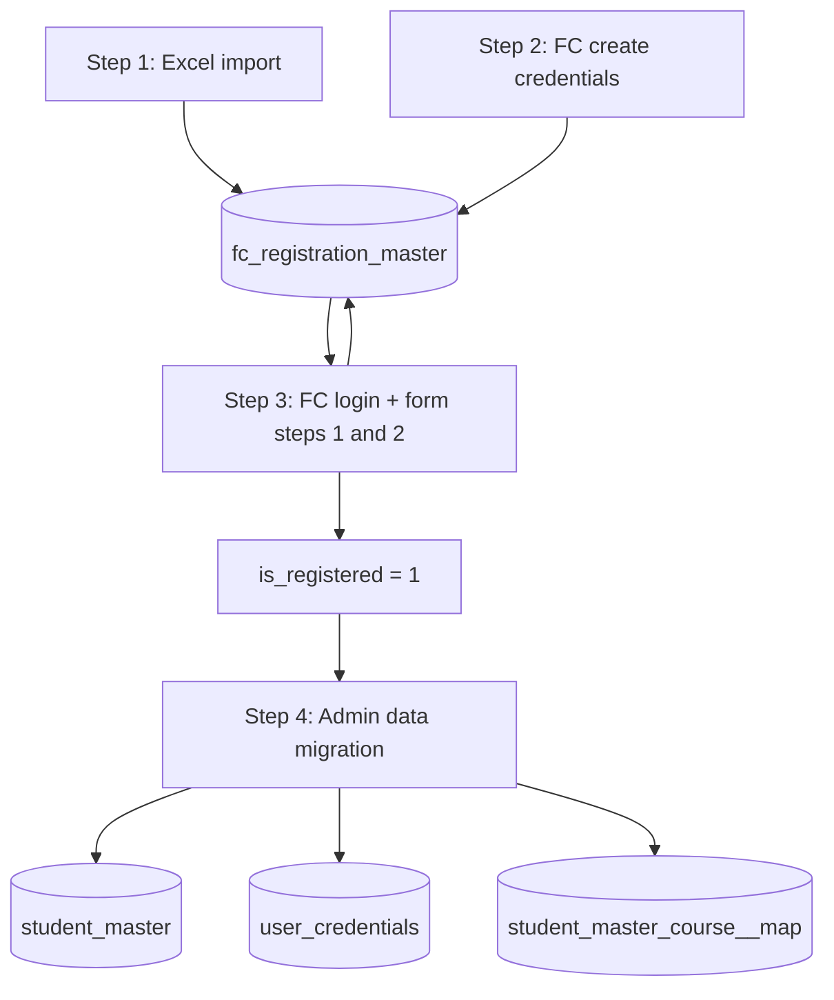

# FC Registration & Data Migration — Standard Flow

**Main source table:** `fc_registration_master`  
All downstream data is derived from this table:

- `student_master`
- `user_credentials`
- `student_master_course__map`

---

## Corrected process (implemented)



---

## Step 1 — Excel import (`/registration/import`)

| Item | Detail |
|------|--------|
| **URL** | `GET /registration/import` → preview → `POST /registration/import/confirm` |
| **Controller** | `RegistrationImportController::importConfirmed` |
| **Writes** | `fc_registration_master` only |

**Typical fields (Template1):** `email`, `contact_no`, `display_name`, `schema_id`, names, `rank`, `exam_year`, `service_master_pk`, `course_master_pk`, `web_auth`.

**Does not set:** `user_id`, `password`, `is_registered`, `admission_status` (remain empty / 0).

---

## Step 2 — Credential creation (`/fc/create-credentials`)

| Item | Detail |
|------|--------|
| **URLs** | `GET /fc/create-credentials`, `POST /fc/store-credentials` |
| **Controller** | `FrontPageController::credential_store` |
| **Prerequisite** | `POST /registration/verify` (mobile + web_auth) |

### Validation

1. Username format rules  
2. **Must not exist** in `user_credentials.user_name`  
3. **Must not exist** on another `fc_registration_master.user_id`  
4. Mobile must match an imported roster row  

### Storage (source table only)

Credentials are stored **only** on `fc_registration_master`:

| Field | Value |
|--------|--------|
| `user_id` | Chosen username |
| `password` | Hashed password (bcrypt) |
| `application_type` | Updated as before |

**Does not set** `is_registered` here (see below).

**Does not write** `user_credentials` at this step.

**Login:** `/fc/login` authenticates **only** against `fc_registration_master.user_id` + `password`. Before auth, if the username already exists in `user_credentials`, login is rejected (“User already exists” — use main `/login` after migration). The main application login (`/login`) is unchanged. After FC login, trainees complete dynamic forms at `/fc-reg/forms/…`.

---

## Step 3 — Login and form completion (before migration)

| Item | Detail |
|------|--------|
| **URL** | `GET/POST /fc/login` → `/fc-reg/forms/{form}` |
| **Auth** | Password on `fc_registration_master` only; rejects if `user_credentials.user_name` already exists |
| **Outcome** | First two active form steps complete → `is_registered = 1` |
| **Form `user_id`** | Before migration, FC form tables store `fc_registration_master.pk` in `user_id`; admin migration re-keys to `user_credentials.pk` |

---

## When `is_registered` becomes `1`

| Default | `is_registered = 0` (import / new roster rows) |
| Set to `1` | Trainee completes **both** of the **first two active steps** (by `step_number`) on their FC form |

Synced automatically via `FcRegistrationRegisteredSyncService` after each step save (dynamic `/fc-reg/forms/…` and legacy step 1/2).

**User match:** `user_credentials.user_name` → `user_id`, or `mobile_no` → `contact_no`; pre-migration login uses staged `user_id` on the same roster row.

**Not set by:** Excel import, credential staging, or migration batch.

---

## Step 4 — Data migration (`/admin/migrate-students`)

| Item | Detail |
|------|--------|
| **URL** | `POST /admin/migrate-fc-registration` |
| **Controller** | `StudentImportController::migrate` |

### Eligible rows

- `is_registered = 1`
- `user_id` not empty
- `password` not empty
- Not already in `user_credentials` (same `user_name` as roster `user_id`)

### A. `fc_registration_master` → `student_master`

Existing business logic: profile fields copied/updated by `user_id` (e.g. `contact_no` → `contact_no`).

### B. `fc_registration_master` → `user_credentials`

Created **only during migration** (not at credential step):

| fc_registration_master | user_credentials |
|------------------------|------------------|
| `user_id` | `user_name` |
| `first_name` | `first_name` |
| `last_name` | `last_name` |
| `password` | `jbp_password` |
| `email` | `email_id` |
| `contact_no` | `mobile_no` |
| `alternative_email` (fallback `pemail_id`) | `alternate_mailid` |

Plus standard student fields: `user_category = S`, `security_answer` = `web_auth`, etc.

After `student_master` insert: `user_credentials.user_id` = `student_master.pk`.

## Step 4 — Course mapping

If `course_master_pk` is set on the source row, migration creates `student_master_course__map`:

- `student_master_pk` ← `student_master.pk`
- `course_master_pk` ← source course

Duplicate student+course pairs are skipped.

---

## Operational order (required)

```
1. Admin: Excel import
2. Student: Verify → Create credentials (staging on fc_registration_master)
3. Admin: Data migration
4. Student: Login (/fc/login) — works after step 3
5. Optional: Course enrollment / FC forms
```

---

## Consistency rules

| Link | Rule |
|------|------|
| Username | `fc_registration_master.user_id` = `user_credentials.user_name` = `student_master.user_id` |
| Mobile | `contact_no` = `mobile_no` |
| Email | `email` = `email_id` |
| Password | Set once on source at Step 2; copied to `jbp_password` at Step 3 |
| Student PK | `user_credentials.user_id` = `student_master.pk` after migration |

---

## URLs quick reference

| Step | Route |
|------|--------|
| Import | `students.index` / `admin.registration.import.form` |
| Verify | `registration.verify` |
| Credentials | `credential.registration.create` / `credential.registration.store` |
| Migrate | `students.index` / `admin.migrate.fc` |

---

## Legacy data note

Students who already have `user_credentials` from the **old** flow but no `password` on `fc_registration_master` will **not** match the new migration filter until credentials are re-staged on the source row (or `password` + `user_id` are set manually on `fc_registration_master`).

---

*Aligned with `FrontPageController::credential_store` and `StudentImportController::migrate`.*
